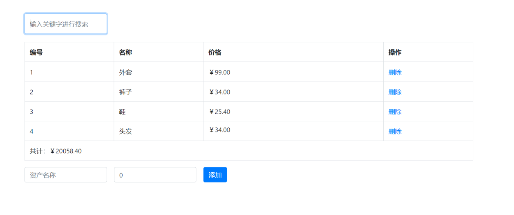
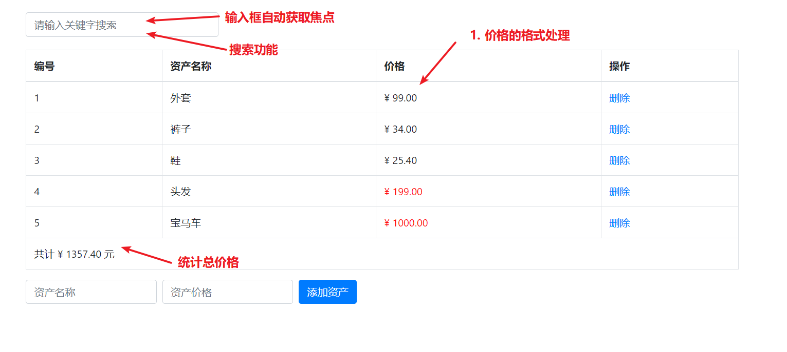
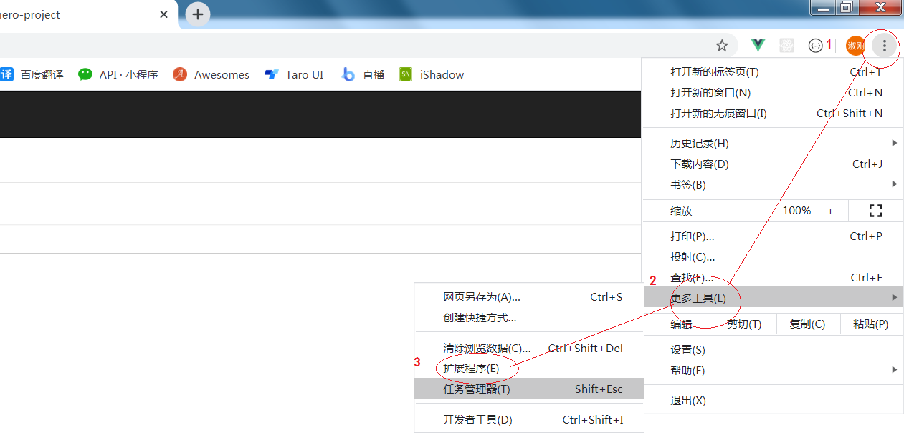
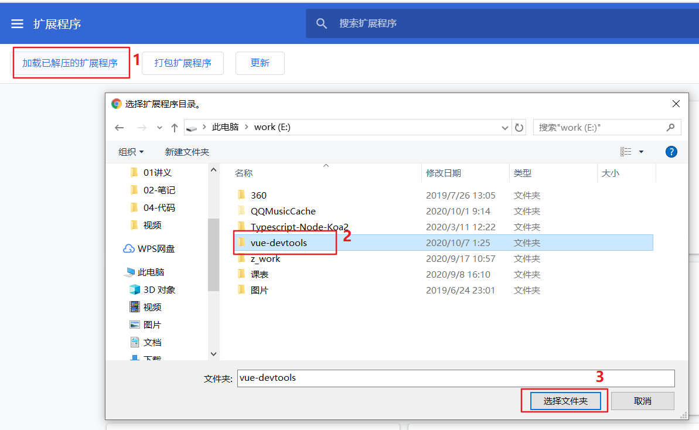
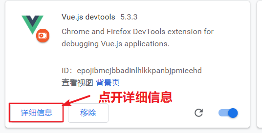
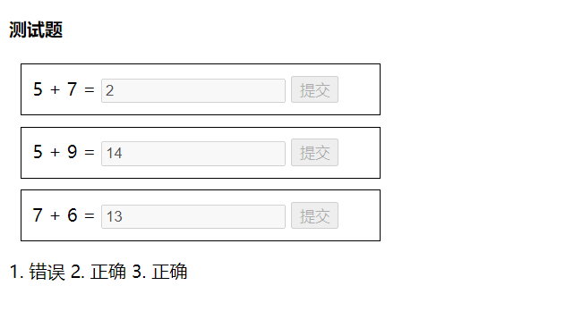

# vue 基础

## 课程介绍

- vue基础 - 7 天

- vue 后台管理项目 - 10 天
- webpack - 1 天
- vue 移动黑马头条 - 10天


## vue 的基本概念

vue官网地址:  https://cn.vuejs.org/

什么是 vue ?  vue是一个渐进式的 javascript 框架   

1. 渐进式  =>  逐渐增强, 可以学一点用一点, 利于上手!!!

2. 框架:  一套完整的解决方案

   特点: 需要按照框架的规则编写代码

   好处: 大大的提升了开发效率


## vue是一个MVVM的框架

MVVM是一种设计模式, 从后端的 MVC模式 演化而来

MVVM

1. M: Model 数据模型, 可以是自己准备的数据, 也可以是请求回来的数据
2. V: View 视图, 视图相关的
3. VM: ViewModel 视图模型, 既可以操作数据, 也可以操作视图


## vue初体验

1. 安装下载 vue

```txt
npm i vue
```

2. 引入一个 vue

3. 使用 vue - 初始化 vue 实例  **指定视图 和 数据**

```html
<div id="app">
  <h1>{{ msg }}</h1>
  <h1>{{ msg }}</h1>
</div>

<script src="./vue.js"></script>
<script>
  // 只要引入 vue.js, 那么全局就有了一个Vue 构造函数
  // 创建vue实例
  const vm = new Vue({
    // 指定视图 + 数据
    // 1. el element, 用于指定vue所管理的视图范围, 值是一个选择器
    el: '#app',
    // 2. data, 用于指定vue中可以使用的数据
    data: {
      msg: '你好, vue'
    }
  })
</script>
```


## vue使用的注意点

1. new Vue() 构造函数Vue, 首字母大写

2. el 不能指定为 html 和 body, 但是可以是一个大的div

3. 到了vue, 不要老想着操作dom了, 要更新视图, 操作数据即可     vm.xxx = 值


## vue 模板代码段的配置

左下角设置 => 用户代码段 =>  输入 html 回车


把原有的内容删除, 复制下面的内容进去

```json
{
  // 名字: 标识, 可以自己起
  "vue-template": {
    // 输入什么内容, 触发代码段   tpl + tab 触发代码段
    "prefix": "tpl",
    "body": [
      "<!DOCTYPE html>",
      "<html lang=\"en\">",
      "	<head>",
      "		<meta charset=\"UTF-8\" />",
      "		<meta name=\"viewport\" content=\"width=device-width, initial-scale=1.0\" />",
      "		<meta http-equiv=\"X-UA-Compatible\" content=\"ie=edge\" />",
      "		<title>Document</title>",
      "	</head>",
      "	<body>",
      "		<div id=\"app\">",
      "			{{ msg }}",
      "		</div>",
      "",
      "		<script src=\"./vue.js\"></script>",
      "		<script>",
      "			const vm = new Vue({",
      "				el: '#app',",
      "				data: {",
      "					msg: 'hello vue$1'",
      "				}",
      "			})",
      "		</script>",
      "	</body>",
      "</html>"
    ],
    "description": "vue 模板"
  }
}
```


# vue的插值表达式

插值表达式, 小胡子语法` {{  }}`

1. 作用:  使用 data 中的数据渲染视图

2. 基本语法, 支持三元运算符

   ```jsx
   {{ msg }}
   {{ obj.name }}
   {{ msg.toUpperCase() }}
   {{ obj.age > 18 ? '成年' : '未成年' }}
   ```

3. vue中插值表达式的注意点

   (1)  使用的数据在 data 中要存在

   ```jsx
   <h1>{{ gaga }}</h1>
   ```

   (2)  能使用表达式, 但是不能使用 if  for

   ```jsx
   <h1>{{ if (obj.age > 18 ) { }   }}</h1>
   ```

   (3)  不能在标签属性中使用

   ```jsx
   <h1 id="box" class="box" title="{{ msg }}"></h1>
   ```

   

# vue指令

**vue指令, 实质上就是特殊的 html 标签属性, 特点:  v- 开头**

每个 v- 开头的指令, 都有着自己独立的功能, 将来vue解析时, 会根据不同的指令提供不同的功能

## v-text 和 v-html

- v-text 设置元素的 innerText, 不识别标签, 基本可以被 插值表达式 替代, 不太常用
- v-html 设置元素的 innerHTML, 可以识别标签,  需要识别标签的时候, 使用v-html即可

```html
<div id="app">
  <h1>{{ msg }} 嘿嘿, 呵呵, 嘎嘎 {{ info }}</h1>
  <h1 v-text="msg"></h1>
  <h1 v-html="msg"></h1>
</div>

<script src="./vue.js"></script>
<script>
  const vm = new Vue({
    el: '#app',
    data: {
      msg: '<a href="#">我是a标签</a>',
      info: '你好'
    }
  })
</script>
```


## v-if 和 v-show

v-show 和 v-if 功能: 控制盒子的显示隐藏

1. v-show

   语法:  v-show="布尔值"    (true显示, false隐藏)

   原理:  实质是在控制元素的 css 样式,  `display: none;`

2. v-if

   语法: v-if="布尔值"   (true显示, false隐藏)

   原理:  实质是在动态的创建 或者 删除元素节点

应用场景: 

- 如果是频繁的切换显示隐藏, 用 v-show

  v-if, 频繁切换会大量的创建和删除元素, 消耗性能

- 如果是不用频繁切换, 要么显示, 要么隐藏的情况, 适合于用 v-if

  v-if 是惰性的, 如果初始值为 false, 那么这些元素就直接不创建了, 节省一些初始渲染开销

```html
<div id="app">
  <h1 v-show="flag">{{ msg }}</h1>
  <h1 v-if="flag">{{ msg }}</h1>
</div>

<script src="./vue.js"></script>
<script>
  const vm = new Vue({
    el: '#app',
    data: {
      msg: 'hello vue',
      flag: true
    }
  })
</script>
```


## v-else 和 v-else if

```html
<div id="app">
  <h1 v-if="isLogin">尊敬的超级vip, 你好</h1>
  <h1 v-else>你谁呀, 赶紧登陆~</h1>

  <hr>
  
  <h1 v-if="age >= 60">60岁以上, 广场舞</h1>
  <h1 v-else-if="age >= 30">30岁以上, 搓麻将</h1>
  <h1 v-else-if="age >= 20">20岁以上, 蹦迪</h1>
  <h1 v-else>20岁以下, 唱跳rap篮球</h1>
</div>

<script src="./vue.js"></script>
<script>
  const vm = new Vue({
    el: '#app',
    data: {
      msg: 'hello vue',
      isLogin: true,
      age: 18
    }
  })
</script>
```


## v-on指令

v-on功能: 用于注册事件 

1. 写内联语句, 将要执行的代码直接写在 "" 内部, 适合写少量代码

      v-on:事件名="要执行的代码"

2. 指向methods中的定义的函数

      v-on:事件名="methods中的函数"

3. 指向methods中的定义的函数，并传入参数

      v-on:事件名="methods中的函数(实参)"

 简写: @事件名

```html
<div id="app">
  <h3>v-on</h3>
  <div v-show="isShow">内容部分</div>
  
  <button v-on:click="isShow = !isShow">切换显示隐藏</button>
  <button v-on:click="fn1">切换显示隐藏</button>
  <button v-on:click="fn2(1, 2)">点击时调用函数并传值</button>
  
  <hr>
  
  <button @click="isShow = !isShow">切换显示隐藏</button>
  <button @click="fn1">切换显示隐藏</button>
  <button @click="fn2(1, 2)">点击时调用函数并传值</button>
  
</div>

<script src="./vue.js"></script>
<script>
  const vm = new Vue({
    el: '#app',
    data: {
      isShow: true
    },
    methods: {
      fn1 (e) {
        this.isShow = !this.isShow
      },
      fn2 (a, b) {
        console.log(a, b)
      }
    }
  })
</script>
```


## 案例-折叠面板

需求: 点击展开或收起时，把内容区域显示或者隐藏

```html
<!DOCTYPE html>
<html lang="en">
  <head>
    <meta charset="UTF-8" />
    <meta name="viewport" content="width=device-width, initial-scale=1.0" />
    <title>Document</title>
    <style>
      body {
        background-color: #ccc;
      }
      #app {
        width: 400px;
        margin: 20px auto;
        background-color: #fff;
        border: 4px solid blueviolet;
        border-radius: 1em;
        box-shadow: 3px 3px 3px rgba(0, 0, 0, 0.5);
        padding: 1em 2em 2em;
      }
      h3 {
        text-align: center;
      }
      .title {
        display: flex;
        justify-content: space-between;
        align-items: center;
        border: 1px solid #ccc;
        padding: 0 1em;
      }
      .title h4 {
        line-height: 2;
        margin: 0;
      }
      .container {
        border: 1px solid #ccc;
        padding: 0 1em;
      }
      .btn {
        /* 鼠标改成手的形状 */
        cursor: pointer;
      }
    </style>
  </head>
  <body>
    <div id="app">
      <h3>案例：折叠面板</h3>
      <div>
        <div class="title">
          <h4>芙蓉楼送辛渐</h4>
          <span class="btn" @click="isShow = !isShow">
            {{ isShow ? '收起' : '展开' }}
          </span>
        </div>
        <div class="container" v-show="isShow">
          <p>寒雨连江夜入吴，</p>
          <p>平明送客楚山孤。</p>
          <p>洛阳亲友如相问，</p>
          <p>一片冰心在玉壶。</p>
        </div>
      </div>
    </div>
    <script src="./vue.js"></script>
    <script>
      // 点击展开或收起时，把内容区域显示或者隐藏
      const vm = new Vue({
        el: '#app',
        data: {
          isShow: true
        }
      })
    </script>
  </body>
</html>
```


## v-on 按键修饰符

需求: 默认a标签点击会跳走,  希望阻止默认的跳转, 阻止默认行为  e.preventDefault()

- vue中获取事件对象

  (1) 没有传参, 通过形参接收 e

  (2) 传参了, 通过$event指代事件对象 e

- vue中提供的按键修饰符

  .prevent 阻止默认行为

  .stop 阻止冒泡

```html
<div id="app">
  <a @click="fn" href="http://www.baidu.com">去百度</a>
  <a @click="fn2(100, $event)" href="http://www.baidu.com">去百度2</a>
  <a @click.prevent="fn" href="http://www.baidu.com">去百度3</a>
</div>

<script src="./vue.js"></script>
<script>
  // 需求: 默认a标签点击会跳走,  希望阻止默认的跳转, 阻止默认行为  e.preventDefault()
  // - vue中获取事件对象
  // - vue中提供的按键修饰符
  //   .prevent 阻止默认行为
  //   .stop    阻止冒泡

  const vm = new Vue({
    el: '#app',
    data: {
      msg: 'hello vue'
    },
    methods: {
      fn (e) {
        e.preventDefault()
      },
      fn2 (num, e) {
        e.preventDefault()
      },
      fn3 () {
        console.log('嘿嘿')
      }
    }
  })
</script>
```


## v-bind指令

**作用: 访问data中的数据,  动态的设置html的标签属性**

语法: `v-bind:属性名="值"` ,  简写 `:属性名  = 值 `

```html
<div id="app">
  
  
</div>

<script src="./vue.js"></script>
<script>
  const vm = new Vue({
    el: '#app',
    data: {
      imgUrl: '02.jpg',
      msg: '这是一个美图',
      bb: '内容'
    }
  })
</script>
```


## v-for 

 v-for 作用: 遍历对象和数组

1. 遍历数组 (常用)

```
v-for="item in 数组名"  item每一项
v-for="(item, index) in 数组名"  item每一项 index下标
```

2. 遍历对象 (一般不用)

```
v-for="(value, prop) in 对象"  value属性值, prop属性名
```

```html
<div id="app">
  <ul>
    <li v-for="item in list">{{ item }}</li>
  </ul>

  <ul>
    <li v-for="(item, index) in list">{{ item }} 和 {{ index }}</li>
  </ul>

  <ul>
    <li v-for="(value, prop) in obj"> {{ value }} 和 {{ prop }}</li>
  </ul>
</div>

<script src="./vue.js"></script>
<script>
  const vm = new Vue({
    el: '#app',
    data: {
      list: ['貂蝉', '吕布', '小乔', '曹操'],
      obj: {
        name: '大桥',
        age: 79,
        desc: '坚固'
      }
    }
  })
</script>
```

3. 一般为了优化渲染的性能, 可以在遍历列表时, 加上一个 key属性, key一般指定成 id  (详细原理: 参见拓展视频)

```html
<div id="app">
  <!-- 一般为了优化渲染的性能, 可以在遍历列表时, 加上一个 key属性, key一般指定成 id -->
  <ul>
    <li v-for="item in list" :key="item.id">{{ item.name }} -- {{ item.price }}元/斤</li>
  </ul>
</div>

<script src="./vue.js"></script>
<script>
  const vm = new Vue({
    el: '#app',
    data: {
      list: [
        { id: 1, name: '苹果', price: '1.8', num: '10斤' },
        { id: 2, name: '鸭梨', price: '5.8', num: '20斤' },
        { id: 3, name: '榴莲', price: '9.8', num: '50斤' },
        { id: 4, name: '西瓜', price: '11.8', num: '60斤' }
      ]
    }
  })
</script>
```


## 案例: 购物车

功能1: 渲染数据

功能2: 删除数据

功能3: 删除光了, 购物车为空的提示消息

```html
  <body>
    <div id="app">
      <h3>我的购物车</h3>
      <div class="list">
        <div v-for="item in bookList" :key="item.id" class="book" :title="item.name">
          <a href="javascript:;">
            <div class="figure">
              
            </div>
            <h4 class="title" :title="item.name">
              {{ item.name }}
            </h4>
            <p class="desc"></p>
            <p class="price"><span class="num">{{ item.price }}</span></p>
          </a>
          <button @click="delBook(item.id)" class="btn" title="移出购物车">-</button>
        </div>
      </div>
      <div v-if="bookList.length == 0">购物车是空的！</div>
    </div>
    <script src="./vue.js"></script>
    <script>
      const vm = new Vue({
        el: '#app',
        data: {
          bookList: [
            {
              id: 1,
              name: '当你学会独处',
              price: 29.9,
              picSrc: 'http://img3m8.ddimg.cn/70/15/28522168-1_l_3.jpg'
            },
            ...
          ]
        },
        methods: {
          delBook (id) {
            this.bookList = this.bookList.filter(item => item.id !== id)
          }
        }
      })
    </script>
  </body>
```


## 补充: v-bind 对于 class 的增强

v-bind 对于类名操作的增强, 注意点, :class 不会影响到原来的 class 属性

:class="对象/数组"

```js
(1) :class="对象" 
	{ 类名: 布尔值, 类名: 布尔值 } 
	如果是true, 加上这个类, 如果是false, 移除这个类

(2) :class="数组"
	['类名1', '类名2', '类名3']
	只要有这个类, 就加上

(3) :class="对象/数组" 直接内联在结构中编写 (重点)
```

代码

```html
<!DOCTYPE html>
<html lang="en">
  <head>
    <meta charset="UTF-8" />
    <meta name="viewport" content="width=device-width, initial-scale=1.0" />
    <meta http-equiv="X-UA-Compatible" content="ie=edge" />
    <title>Document</title>
    <style>
      .base {
        width: 200px;
        height: 200px;
        background-color: pink;
      }
      .blue {
        background-color: blue;
      }
      .large {
        width: 400px;
        height: 400px;
      }
    </style>
  </head>
  <body>
    <!-- 
      v-bind 对于类名操作的增强, 注意点, :class 不会影响到原来的 class 属性
      :class="对象/数组"
      (1) :class="对象" 
          { 类名: 布尔值, 类名: 布尔值 } 
          如果是true, 加上这个类, 如果是false, 移出这个类

      (2) :class="数组"
          ['类名1', '类名2', '类名3']
          只要有这个类, 就加上

      (3) :class="对象/数组" 直接内联在结构中编写 (重点)

      最经典的写法: <div class="base" :class="{ blue: isBlue, large: isLarge }"></div>
     -->

    <div id="app">
      <div class="base" :class="obj">我是盒子</div>
      <hr>
      <div class="base" :class="arr">我是盒子</div>
      <hr>
      <div class="base" :class="{ blue: isBlue, large: isLarge }"></div>
    </div>

    <script src="./vue.js"></script>
    <script>
      const vm = new Vue({
        el: '#app',
        data: {
          msg: 'hello vue',
          obj: {
            blue: false,
            large: true
          },
          arr: ['pengpeng', 'large'],
          isBlue: false,
          isLarge: false
        }
      })
    </script>
  </body>
</html>
```


## 补充: v-bind 对于 style 的增强

```
:style="对象"  => :style="obj"
               =>  :style="{ width: '200px' }"
```

```html
<!DOCTYPE html>
<html lang="en">
  <head>
    <meta charset="UTF-8" />
    <meta name="viewport" content="width=device-width, initial-scale=1.0" />
    <meta http-equiv="X-UA-Compatible" content="ie=edge" />
    <title>Document</title>
  </head>
  <body>
    <div id="app">
      <div style="width: 200px; height: 100px; background-color: skyblue;" :style="obj">
        {{ msg }}
      </div>

      <div 
        style="width: 200px; height: 100px; background-color: skyblue;" 
        :style="{ width: '100px', height: '100px', backgroundColor: 'purple' }"
      >
        {{ msg }}
      </div>
    </div>
    <script src="./vue.js"></script>
    <script>
      const vm = new Vue({
        el: '#app',
        data: {
          msg: 'hello vue',
          obj: {
            width: '300px',
            height: '300px',
            backgroundColor: 'pink'
          }
        }
      })
    </script>
  </body>
</html>
```


## v-model

**作用: 给表单元素使用, 双向数据绑定 ** 

语法: v-model='值'

```html
<div id="app">
  <h1>{{ msg }}</h1>
  <input type="text" v-model="msg">
  <hr>
  用户名: <input type="text" v-model="username"> <br><br>
  密码: <input type="password" v-model="password"> <br><br>
  <button>登录</button>
</div>

<script src="./vue.js"></script>
<script>
  const vm = new Vue({
    el: '#app',
    data: {
      msg: 'hello vue',
      username: '',
      password: ''
    }
  })
</script>
```


## v-model 处理其他表单元素

**v-model 会忽略掉表单元素原本的value, checked等初始值**

textarea, select, checkbox

```html
<div id="app">
  <input type="text" v-model="msg">
  <hr>
  <textarea v-model="desc"></textarea>
  <p>{{ desc }}</p>
  <hr>
  <!-- select框的value值, 就是选中的option的value值 
       1. 可以用于获取
       2. 还可以用于设置
  -->
  <select v-model="cityId">
    <option value="1">上海</option>
    <option value="2">无锡</option>
    <option value="3">香港</option>
    <option value="4">北京</option>
    <option value="5">哈尔滨</option>
    <option value="6">齐齐哈尔</option>
  </select>
  <p>{{ cityId }}</p>
  <hr>
  <input type="checkbox" v-model="flag">
  <p>{{ flag }}</p>
</div>

<script src="./vue.js"></script>
<script>
  // 注意点: v-model设置了之后, 会忽略掉默认设置的value, checked等属性
  // 表单元素小练习
  // 1. textarea  value
  // 2. select/option  value
  // 3. checkbox复选框  checked属性

  const vm = new Vue({
    el: '#app',
    data: {
      msg: '123456',
      desc: '今天天气还行',
      cityId: 6,
      flag: false
    }
  })
</script>
```


## v-model 修饰符

- number

  如果想自动将用户的输入值, 用parseFloat转成数字类型, ，可以给 `v-model` 添加 `number` 修饰符：

  ```html
  <input v-model.number="age" type="number">
  ```

  如果这个值如果这个值无法转数字，则会返回原始的值。

- trim

  如果要自动过滤用户输入的首尾空白字符，可以给 `v-model` 添加 `trim` 修饰符：

  ```html
  <input v-model.trim="msg">
  ```

  

## 案例: 资产表格



目标：

- 1 完成表格列表渲染。
- 2 实现删除功能。
- 3 标注：如果价格超过100，标红色显示。
- 4 添加功能。

静态布局

```html
<!DOCTYPE html>
<html lang="en">
<head>
  <meta charset="UTF-8">
  <meta name="viewport" content="width=device-width, initial-scale=1.0">
  <title>Document</title>
  <link href="https://cdn.bootcdn.net/ajax/libs/twitter-bootstrap/4.4.1/css/bootstrap.min.css" rel="stylesheet">
</head>
<body>
  <div id="app">
    <div class="container">
      <table class="table table-bordered table-hover">
        <thead>
          <tr>
            <th>编号</th>
            <th>资产名称</th>
            <th>价格</th>
            <th>操作</th>
          </tr>
        </thead>
        <tbody>
          <tr>
            <td>1</td>
            <td>宝马</td>
            <td>20000</td>
            <td><a href="javascript:;">删除</a></td>
          </tr>
        </tbody>
      </table>
      
      <!-- 添加资产 -->
      <form class="form-inline">
        <div class="form-group">
          <div class="input-group">
            <input type="text" class="form-control" placeholder="资产名称" />
          </div>&nbsp;&nbsp;
          <div class="input-group">
            <input type="text" class="form-control" placeholder="资产价格" />
          </div>
        </div>&nbsp;&nbsp;
        <button class="btn btn-primary">添加资产</button>
      </form>
    </div>
  </div>
  <script>
      // 目标：
      // 1. 把表格数据显示出来
      // 2. 实现删除功能
      // 3. 标注：如果价格超过100，标红色显示。
      // 4. 添加功能
      
      // list: [
      //     { id: 1, name: '外套', price: 99 },
      //     { id: 2, name: '裤子', price: 34 },
      //     { id: 3, name: '鞋', price: 25.4 },
      //     { id: 4, name: '头发', price: 199 }
      // ]
  </script>
</body>
</html>
```

1 完成表格列表渲染

```html
<tbody>
  <tr v-for="(item, index) in list" :key="item.id">
    <td>{{ index + 1 }}</td>
    <td>{{ item.name }}</td>
    <td>{{ item.price }}</td>
    <td><a href="javascript:;">删除</a></td>
  </tr>
</tbody>
```

2 删除功能

```jsx
<td><a @click="del(item.id)" href="javascript:;">删除</a></td>

methods: {
  del (id) {
    this.list = this.list.filter(item => item.id !== id)
  }
}
```

3 标注：如果价格超过100，标红色显示。

```jsx
<style>
  .red {
    color: red;
  }
</style>

<td :class="{ red: item.price > 100 }">{{ item.price }}</td>
```

4 添加功能

- 1 注册添加的点击事件, 注意: 需要阻止默认行为

```jsx
<button @click.prevent="add" class="btn btn-primary">添加资产</button>
```

- 2 收集获取的输入信息  v-model 绑定

```jsx
<input v-model.trim="name" type="text" class="form-control" placeholder="资产名称" />

<input v-model.number="price" type="text" class="form-control" placeholder="资产价格" />
```

- 3 判断非空, 添加到 list 中

```js
add () {
  // console.log(this.name, this.price)
  // 简单非空判断
  if (this.name === '') return
  if (this.price === '' || this.price <= 0) return
  this.list.push({
    id: +new Date(),
    name: this.name,
    price: this.price
  })
  this.name = ''
  this.price = ''
}
```


# 未完成功能说明(目标)

**还有一些功能如果要实现, 需要学习新的语法~**



# 过滤器

## 过滤器的基本使用

过滤器的作用: 转换格式

过滤器本质上就是一个函数

```
格式x --- 过滤器 -----> 格式y
```

将来开发过程中, 肯定会有对于字符串进行处理转换的需求, vue中提供了一个专门的语法: 过滤器

1. 定义过滤器
   Vue.filter(过滤器名字, 处理字符串的函数)
   (1) 函数的返回值, 就是处理字符串的结果
   (2) 函数的形参, 可以拿到处理的字符串
2. 使用过滤器 `{{ msg | 过滤器名字 }}`

```html
<div id="app">
  <h1>{{ msg1 | upper }}</h1>
  <h1>{{ msg2 | upper }}</h1>
</div>

<script src="./vue.js"></script>
<script>
  Vue.filter('upper', function(value) {
    return value.toUpperCase()
  })

  const vm = new Vue({
    el: '#app',
    data: {
      msg1: 'hellovue',
      msg2: 'zhangsan'
    }
  })
</script>
```


## 利用过滤器处理日期

moment官网文档: http://momentjs.cn/docs/#/displaying/


```html
<div id="app">
  <h1>{{ date1 | time }}</h1>
  <h1>{{ date2 | time }}</h1>
</div>

<script src="./vue.js"></script>
<script src="./node_modules/moment/moment.js"></script>
<script>
  Vue.filter('time', function(value) {
    return moment(value).format('YYYY年MM月DD日 HH:mm:ss')
  })

  const vm = new Vue({
    el: '#app',
    data: {
      date1: 1601305782038,
      date2: 1201305782038
    }
  })
</script>
```


## 过滤器的参数

使用过滤器支持传参

```
{{ msg | 过滤器名字(参数1, 参数2) }}
```

代码

```html
<div id="app">
  <h1>{{ date1 | time("YYYY-MM-DD") }}</h1>
  <h2>{{ date2 | time }}</h2>
  <h2>{{ date2 | time }}</h2>
</div>

<script src="./vue.js"></script>
<script src="./node_modules/moment/moment.js"></script>
<script>
  Vue.filter('time', function(value, str='YYYY年MM月DD日 HH:mm:ss') {
    return moment(value).format(str)
  })

  const vm = new Vue({
    el: '#app',
    data: {
      date1: 1601305782038,
      date2: 1201305782038
    }
  })
</script>
```


## 全局过滤器 和 局部过滤器

全局过滤器: 在所有的vue实例中, 都可以使用 

局部过滤器: 只能在当前的vue实例中, 使用

```html
<div id="app">
  <h1>{{ msg | global | demo }}</h1>
</div>

<div id="app2">
  <h1>{{ msg | global | demo }}</h1>
</div>

<script src="./vue.js"></script>
<script>
  // 全局过滤器: 在所有的vue实例中, 都可以使用 
  // 局部过滤器: 只能在当前的vue实例中, 使用
  Vue.filter('global', function(value) {
    return value + '_global'
  })

  const vm = new Vue({
    el: '#app',
    data: {
      msg: 'hello vue'
    },
    filters: {
      // 过滤器名字: 处理函数
      demo: function(value) {
        return value + '_demo'
      }
    }
  })


  const vm2 = new Vue({
    el: '#app2',
    data: {
      msg: 'hello vue2'
    }
  })
</script>
```


## 资产表格 - 使用过滤器


```jsx
// 过滤器
Vue.filter('money', function(value) {
  return '¥ ' + value.toFixed(2)
})
```


# 自定义指令

目标: 一进入页面, 希望输入框能够获取焦点


## 自定义指令的基本使用

需求: 让输入框获取焦点

1. 定义指令 

   Vue.directive(指令名, 配置对象)

2. 使用指令

   使用时, v-指令名,  注意加上 v- 开头

```html
<div id="app">
  <input type="text">
  <input type="text">
  <input type="text" v-focus>
  <input type="text">
  <input type="text">
</div>

<script src="./vue.js"></script>
<script>
  // autofocus 有一定兼容, vue中不推荐直接使用
  // vue中推荐, 使用js的方式让元素获取焦点 inp.focus(), 将这个dom操作封装到自定义指令中
  
  // 自定义指令的语法:
  // 1. 定义指令
  // Vue.directive(指令名, 配置对象)
  // 2. 使用指令
  // 注意: v-指令 名
  Vue.directive('focus', {
    // inserted是一个函数, 会在指令所在元素被插入到页面中时执行
    inserted (el) {
      el.focus()
    }
  })
  
  const vm = new Vue({
    el: '#app',
    data: {
      msg: 'hello vue'
    }
  })
</script>
```


## 全局指令 和 局部指令

全局指令: 在任何vue实例中, 都可以访问到

局部指令: 只能在当前vue实例中可以访问

```jsx
// 全局定义
Vue.directive('focus', {
  // inserted是一个函数, 会在指令所在元素被插入到页面中时执行
  inserted (el) {
    el.focus()
  }
})

const vm = new Vue({
  el: '#app',
  data: {
    msg: 'hello vue'
  },
  directives: {
    // 局部定义
    red: {
      inserted (el) {
        el.style.color = 'red'
      }
    }
  }
})
```


## 案例: 资产表格 - 自定义指令

```js
// 自定义指令
Vue.directive('focus', {
  inserted (el) {
    el.focus()
  }
})
```


# 计算属性

需求: 要对 给定的字符串做翻转之后 再来显示

```html
<div id="app">
  <!-- 此处逻辑复杂 -->
  <h1>{{ msg.split('').reverse().join('') }}</h1>
</div>

<script src="./vue.js"></script>
<script>
  const vm = new Vue({
    el: '#app',
    data: {
      msg: 'javascript'
    }
  })
</script>
```

模板中写大量的表达式, 固然可以实现效果, 但是会使得模板过重, 难以维护

如果一个结果, 需要依赖data中的数据, 但是需要经过一些逻辑处理, 才能得到你想要的数据, 可以使用计算属性

## 计算属性基本使用

1. 写在 computed 中

2. 和 data 一样, 都是用于提供属性的

3. 计算属性: 写法是一个函数, 但实质是一个属性

   计算属性: 一个需要通过计算才能得到的属性, 计算的过程封装到了这个函数中, 函数的返回值就是属性值

```html
<div id="app">
  <!-- 此处逻辑复杂 -->
  <h1>{{ reverseMsg }}</h1>
</div>

<script src="./vue.js"></script>
<script>
  const vm = new Vue({
    el: '#app',
    data: {
      msg: 'javascript'
    },
    computed: {
      reverseMsg () {
        return this.msg.split('').reverse().join('')
      }
    }
  })
</script>
```

## 计算属性的优点

1. 将模板中的逻辑, 封装到了计算属性中, 便于维护

2. 计算属性, 有缓存的处理, 如果计算过了一个值, 就会将这个值缓存起来

   下次再获取这个值, 直接将缓存的结果返回 (跳过计算的过程)

3. 如果计算属性依赖的值, 变化了, 会自动重新计算, 并再次缓存

```html
<div id="app">
  <h1>{{ reverseMsgFn() }}</h1>
  <h1>{{ reverseMsgFn() }}</h1>
  <h1>{{ reverseMsgFn() }}</h1>
  <h1>{{ reverseMsgFn() }}</h1>
  <hr>
  <h1>计算属性, 有缓存的处理, 如果计算过了一个值, 就会将这个值缓存起来</h1>
  <h1>{{ reverseMsg }}</h1>
  <h1>{{ reverseMsg }}</h1>
  <h1>{{ reverseMsg }}</h1>
  <h1>{{ reverseMsg }}</h1>
</div>

<script src="./vue.js"></script>
<script>
  const vm = new Vue({
    el: '#app',
    data: {
      msg: 'javascript'
    },
    methods: {
      reverseMsgFn () {
        console.log('函数调用了')
        return this.msg.split('').reverse().join('')
      }
    },
    computed: {
      reverseMsg () {
        console.log('计算属性被执行了')
        return this.msg.split('').reverse().join('')
      }
    }
  })
</script>
```


## 资产表格: 计算属性 - 计算总价

需求: 计算总和


html底部结构

```html
<tfoot>
  <tr>
    <td colspan="4">共计 xxx 元</td>
  </tr>
</tfoot>
```

思路: 补充一个计算属性, 专门用于计算总和

```jsx
computed: {
  total () {
    // 对list中数据进行循环, 计算出总共的 price
    let totalPrice = 0
    this.list.forEach(item => {
      totalPrice += item.price
    })
    return totalPrice
  }
}

<tfoot>
  <td colspan="4">共计 {{ total | money }} 元</td>
</tfoot>
```


## 资产表格: 计算属性 - 搜索筛选

在筛选区域的 input 框中输入关键字, 则在下面的 list 中找出对应的项, 其他的项应该隐藏起来

- 收集用户的搜索关键字,  v-model

```jsx
data: {
	...
	key: ''
}

<input v-model="key" v-focus type="text" class="form-control search" placeholder="请输入关键字搜索">
```

- 定义一个计算属性, 根据关键字在list中进行数据的过滤, 找出符合条件的项展示

```jsx
showList () {
  // console.log(this.key)
  // 根据 this.key 对 list 进行过滤
  // 如果其中name包含 this.key 关键字, 则保留
  return this.list.filter(item => {
    if (item.name.includes(this.key)) {
      return true
    } else {
      return false
    }
  })
}

// 使用 showList
<tr v-for="(item, index) in showList" :key="item.id">
```

- 调整计算总价的计算规则

```js
total () {
  // 对list中数据进行循环, 计算出总共的 price
  let totalPrice = 0
  this.showList.forEach(item => {
    totalPrice += item.price
  })
  return totalPrice
},
```


# 自己写接口-mock(模拟)数据

在开发过程中, 很可能会遇到后端接口滞后的情况 

例如: 前端页面写完了, 后端的接口没有就绪, 我们就可以利用一些工具自己准备接口, 进行自测

## json-server的基本使用

json-server 是一个命令行工具, 可以起一套 增删改查的 遵循 restful 规范的 接口,  零编码

1. 全局安装

```
npm i json-server -g
```

2. 准备一个 json 文件,  data.json 文件

```jsx
{
	"list": [
    { "id": 1, "name": "外套", "price": 99 },
    { "id": 2, "name": "裤子", "price": 34 },
    { "id": 3, "name": "鞋", "price": 25.4 },
    { "id": 4, "name": "头发", "price": 199 }
  ]
}
```

3. 执行命令, 启动接口

```
json-server data.json
```

起的是一整套遵循 RESTful 规范 的接口,  特征:  通过请求方式来决定操作类别（添加，删除，修改，查询）

以上面启动的服务为例：

| 接口地址 | 请求方式 | 操作类型                    |
| -------- | -------- | --------------------------- |
| /list    | GET      | 获取全部数据                |
| /list/1  | GET      | 获取单个数据, 获取id为1的值 |
| /list    | POST     | 添加操作 {name,price}       |
| /list/1  | DELETE   | 删除操作                    |
| /list/1  | PUT      | 完整修改{name,price}        |
| /list/1  | PATCH    | 局部修改{name}              |

以上接口规则，就是restful规则。json-server提供的就是符合restful规则的接口。


## postman测试json-server

使用 postman 测试 json-server 提供的接口

### 获取全部数据

GET: http://localhost:3000/list


### 获取单个数据

以id为查询依据

GET: http://localhost:3000/list/1


### 根据条件查询数据 (搜索)

json-server服务器提供了条件查询的功能 

格式:  ?字段_like=值


注意: 不加引号！


### 添加操作

以json格式传递参数，id会自动增加。  content-type: 'application/json'

POST: http://localhost:3000/list/ 

`{"name": "电脑", "price": 6880}`


### 删除操作

根据id进行删除

DELETE: http://localhost:3000/list/1


### 完整修改

post 和 put patch  参数, 都要求在 body 中传递

以json格式传递参数

PUT: http://localhost:3000/list/3

要求必须传入一个完整的对象（如果这一条记录中有10个属性，则要传入10个属性），因为它会整体覆盖这条数据。


### 局部修改

以json格式传递参数

PATCH: http://localhost:3000/list/3

只需要传入要更改的字段（要修改哪个属性就传入哪个属性 ）。


## axios请求接口

axios 其实就是一个基于原生封装的, 一个用于发送ajax的插件包

axios提交数据的时候, 默认的数据类型 (content-type) 就是 application/json 格式, 和我们json-server接口是统一的

使用步骤:

1. 下载  npm i axios
2. 引包
3. 使用, 发送ajax

```js
axios({
  method: 请求方式,  // get/post/put/patch/delete
  url: 请求地址,
  data: 参数对象, // 这个参数对象会在请求体中进行提交  post/put/patch
  params: 参数对象, // 这个参数对象会在地址栏中拼接提交 get/delete   
}).then(成功的函数).catch(失败的函数)
```

例如:

```jsx
// 1. 获取全部数据
axios({
  method: 'get',
  url: 'http://localhost:3000/list'
}).then(res => {
  console.log(res.data)
}).catch(err => {
  console.log(err)
})

// 2. 按照条件查询数据
axios({
  method: 'get',
  url: 'http://localhost:3000/list',
  params: {
    name_like: '棒'
  }
}).then(res => {
  console.log(res.data)
}).catch(err => {
  console.log(err)
})

// 3. 添加数据
axios({
  method: 'post',
  url: 'http://localhost:3000/list',
  data: {
    name: '宝马车',
    price: 100
  }
}).then(res => {
  console.log(res.data)
}).catch(err => {
  console.log(err)
})
```


## axios的简写形式

对于比较简单接口调用，可以采用简写格式：

```jsx
// get类型的 params参数要放在写对象中
axios.get(url, { params: {} }).then(res=>{console.log('成功')})
                                                               
// post类型 直接写参数
axios.post(url, data).then(res=>{console.log('成功')})
```

代码

```jsx
// 1. 获取全部数据
axios.get('http://localhost:3000/list').then(res => {
  console.log(res.data)
})

// 2. 按照条件查询数据
axios.get('http://localhost:3000/list', { 
  params: { 
    name_like: '棒' 
  }
}).then(res => {
  console.log(res.data)
})

// 3. 添加数据
axios.post('http://localhost:3000/list', {
  name: '宝马车',
  price: 100
}).then(res => {
  console.log(res.data)
})

// 4. 删除数据
axios.delete('http://localhost:3000/list/2').then(res => {
  console.log('删除成功')
})

// 5. 局部修改
axios.patch('http://localhost:3000/list/4', {
  name: '嘎嘎鹏'
}).then(res => {
  console.log('修改成功')
})

// 6. 完整修改
axios.patch('http://localhost:3000/list/5', {
  name: '水果',
  price: 88
}).then(res => {
  console.log('修改成功')
})
```


# 案例: 接口版本的资产管理

**目标：**

- 用json-server启动后端接口服务器

- axios发请求

- 用vue管理视图

 ## axios请求数据

**目标：用axios请求json-server提供的接口，并显示数据出来。**

**静态页面**

```html
<!DOCTYPE html>
<html lang="en">
<head>
  <meta charset="UTF-8">
  <meta name="viewport" content="width=device-width, initial-scale=1.0">
  <title>Document</title>
  <link
    href="https://cdn.bootcdn.net/ajax/libs/twitter-bootstrap/4.4.1/css/bootstrap.min.css"
    rel="stylesheet"
  />
  <style>
    .search {
      width: 250px; 
      margin: 20px 0;
    }
  </style>
</head>

<body>
  <div id="app">
    <div class="container">
      <!-- 搜索 -->
      <input type="text" class="form-control search" placeholder="输入关键字进行搜索">
      <!-- 表格 -->
      <table class="table table-bordered table-hover">
        <thead>
          <tr>
            <th>编号</th>
            <th>资产名称</th>
            <th>资产价格</th>
            <th>操作</th>
          </tr>
        </thead>
        <tbody>
          <tr>
            <td>1</td>
            <td>xxx</td>
            <td>xxxx</td>
            <td><a href="javascript:;">删除</a></td>
          </tr>
        </tbody>
      </table>
      <!-- 添加资产 -->
			<form class="form-inline">
        <input type="text" class="form-control" placeholder="资产名称">
        &nbsp;&nbsp;
        <input type="text" class="form-control" placeholder="资产价格">
        &nbsp;&nbsp;
        <button class="btn btn-primary">添加资产</button>
      </form>
    </div>
  </div>
</body>

</html>
```

发送ajax请求获取数据, 在created发送

- vue可以配置一个 created 函数 (生命周期函数)  

  (其他生命周期函数, 用的不多, 项目后会统一介绍)

- 这个函数会在vue实例创建数据初始化完成后, 自动被调用

- 这个函数适合发送初始化渲染的 ajax 请求

```js
const vm = new Vue({
  el: '#app',
  data: {
    list: []
  },
  // 一进入页面发送ajax请求, 获取数据, 写在created函数中
  created () {
    // 发送获取请求
    axios.get('http://localhost:3000/list').then(res => {
      this.list = res.data
    })
  }
})
```


## 根据数据动态渲染

v-for 渲染即可

```jsx
<tbody>
  <tr v-for="(item, index) in list" :key="item.id">
    <td>{{ index + 1 }}</td>
    <td>{{ item.name }}</td>
    <td>{{ item.price }}</td>
    <td><a href="javascript:;">删除</a></td>
  </tr>
</tbody>
```


## 删除数据

1 注册点击事件, 传id

```jsx
<td><a @click="del(item.id)" href="#">删除</a></td>
```

2 根据id发送ajax请求

```jsx
del (id) {
  axios.delete(`http://localhost:3000/list/${id}`).then(res => {
    console.log('删除成功')
  })
}
```

3 需要重新渲染, 将获取数据的过程封装

```js
created () {
  this.getList()
},
methods: {
  getList () {
    // 发送获取请求
    axios.get('http://localhost:3000/list').then(res => {
      this.list = res.data
    })
  },
  del (id) {
    axios.delete(`http://localhost:3000/list/${id}`).then(res => {
      this.getList()
    })
  }
}
```


## 添加数据

1 注册点击事件, 注意阻止按钮的默认提交

```jsx
<button @click.prevent="add" class="btn btn-primary">添加资产</button>
```

2 添加时, 要获取到输入框的值, v-model进行绑定

```jsx
<input v-model.trim="name" type="text" class="form-control" placeholder="资产名称">

<input v-model.number="price" type="text" class="form-control" placeholder="资产价格">
```

3 进行 ajax 添加操作

```js
add () {
  if (this.name === '') return
  if (this.price === '' || this.price <= 0) return
  axios.post(`http://localhost:3000/list`, {
    name: this.name,
    price: this.price
  }).then(res => {
    this.getList()
    this.name = ''
    this.price = ''
  })
}
```


## 搜索功能 - 计算属性

1 双向绑定搜索框的值 v-model

```jsx
data: {
  key: ''
}

<input v-model="key" type="text" class="form-control search" placeholder="输入关键字进行搜索">
```

2 准备一个计算属性 showList, 根据 key 筛选出需要的数据, 展示

```jsx
computed: {
  showList () {
    return this.list.filter(item => {
      if (item.name.includes(this.key)) {
        return true
      } else {
        return false
      }
    })
  }
}
```

3 使用 showList 进行展示

```jsx
<tr v-for="(item, index) in showList" :key="item.id">
```


思考: 这里能实现, 是因为所有的数据, 我们一个请求都请求回来了, 所以可以基于拿到的数据进行搜索过滤!

**但是实际工作中, 数据量大了, 必然会做分页,  我们将来拿到的就只会是一页的数据, 纯本地就做不了搜索了** 

**那么搜索还是要发送ajax请求实现的!**


**需求: 希望用户在输入框中输, 实时的发送请求, 获取结果展示** => 实时监视输入框数据的变化, 需要用到侦听器

# watch 侦听器

## watch 监视基本语法

```html
<div id="app">
  <h1>{{ msg }}</h1>
  <button @click="fn">改值</button>
</div>

<script src="./vue.js"></script>
<script>
  // vue中提供了 watch 侦听器的语法, 可以监视数据的变化
  const vm = new Vue({
    el: '#app',
    data: {
      msg: 'hello vue',
      str: 'abc',
      obj: {
        name: '小花',
        age: 18
      }
    },
    methods: {
      fn () {
        this.msg = '嘎嘎'
      }
    },
    watch: {
      // 监视msg的变化
      msg (newValue, oldValue) {
        console.log('改变前:', oldValue, ', 改变后:', newValue, )
      },
      // 监视str的变化
      str (newValue, oldValue) {
        console.log('str变化了, 变成了:', newValue)
      },
      // 监视obj.age的变化
      'obj.age' (newValue, oldValue) {
        console.log('小花, 我一直看着你, 你变了, 你今年' + newValue + '岁')
      }
    }
  })
</script>
```

## 深度监视

如果要监视对象中所有属性的变化, 需要深度监视 deep

```jsx
watch: {
  // 如果要监视整个对象中所有属性的变化, 要使用深度监视 deep
  obj: {
    // 默认是false, 一旦配置了true, 表示对这个对象深度监视, 
    // 只要obj的任何一个属性变化了, 都会触发handler  (根据需求用, 不要滥用)
    deep: true,
    // 处理函数, obj变化了, 就会执行handler处理函数
    handler (newValue) {
      console.log(newValue)
    }
  }
}
```


## 资产管理 - 搜索 - ajax版本

```jsx
watch: {
  key (newValue) {
    axios.get('http://localhost:3000/list', {
      params: {
        name_like: newValue
      }
    }).then(res => {
      this.list = res.data
    })
  }
}
```


## 防抖处理 (拓展)

一改就发送 ajax 请求, 发送的 ajax 请求就太多了,  需要做防抖处理  

函数防抖（debounce）：当持续触发事件时，一定时间段内没有再触发事件，事件处理函数才会执行一次，如果设定的时间到来之前，又一次触发了事件，就重新开始延时。 

特征: 不会立刻执行, 先等等看, 在一定时间内没有再次触发, 才执行


如果用户, 一直在修改, 在输入, 就不发请求, 只有一段时间内用户不输入了, 没有再触发事件, 此时才会执行一次, 发送请求

```jsx
watch: {
  key (newValue) {
    clearTimeout(this.timeId)
    this.timeId = setTimeout(() => {
      axios.get('http://localhost:3000/list', {
        params: {
          name_like: newValue
        }
      }).then(res => {
        this.list = res.data
      })
    }, 300)
  }
}
```


# 组件化

## 组件化的概念

没有模块化 ?  之前所有的代码都写在同一个文件中

模块化:  对于 js 功能的拆分

组件化: 是一个对于 结构样式行为的 整体拆分


## 组件的基本使用 - vue组件全局定义

- 基本使用

  (1) 定义:  Vue.component(组件名, 配置)

  (2) 使用:  当成 html 标签

- 注意点:

  (1) 不能使用已有标签

  (2) 组件模板只能有一个根元素

```html
<div id="app">
  <pp-button></pp-button>
  <pp-button></pp-button>
  <pp-button></pp-button>
</div>

<script src="./vue.js"></script>
<script>
  Vue.component('pp-button', {
    // 模板, 指定组件的结构的
    template: `
      <div>
        <button>我是按钮</button>
        <div>我是组件</div>
      </div>
    `
  })

  // 根实例独有的属性 => el
  const vm = new Vue({
    el: '#app',
    data: {
      msg: 'hello vue'
    }
  })
</script>
```

有了组件, 就可以将一个页面, 进行拆分了

```html
<div class="container">
  <jd-header></jd-header>

  <jd-main></jd-main>

  <jd-footer></jd-footer>
</div>
```


## vscode 配置

左下角齿轮点开 => 设置  =>  右上角  =>   打开设置在中间粘进去

```jsx
  "emmet.triggerExpansionOnTab": true,
  // emmet 语法, 能够在js中使用, tab 生成结构
  "emmet.includeLanguages": {
    "javascript": "javascriptreact"
  },
```


## 全局组件 和 局部组件 (了解)

全局组件: 在所有的vue实例中, 都可以使用的组件

局部组件: 只能在当前的vue实例中使用的组件

```html
<div id="app">
  <hello></hello>
  <demo></demo>
</div>

<div id="app2">
  <hello></hello>
  <demo></demo>
</div>

<script src="./vue.js"></script>
<script>

  // 全局组件
  Vue.component('hello', {
    template: `
      <div>我是hello组件</div>
    `
  })

  const vm = new Vue({
    el: '#app',
    data: {
      msg: 'hello vue'
    },
    // filters
    components: {
      // 组件名: 组件配置对象
      demo: {
        template: `
          <div>我是demo组件</div>
        `
      }
    }
  })


  const vm2 = new Vue({
    el: '#app2',
    data: {
      msg: 'hello vue2'
    }
  })
</script>
```


## 组件的其他配置项

组件是可以复用的 vue 实例, 所以vue实例怎么配, 组件就怎么配置

配置区别:

1.  根vue实例, 有 el 参数,  组件需要配置 template
2.  组件中的 data 必须是一个函数, 函数内部需要返回一个对象 (保证数据的独立)

```html
<div id="app">
  <demo></demo>
  <demo></demo>
  <demo></demo>
</div>

<script src="./vue.js"></script>
<script>
  // 组件是可复用的vue实例, new Vue怎么配, 组件也可以怎么配
  // 例如: data methods computed watch ...
  Vue.component('demo', {
    template: `
      <div>
        <div>我是demo组件 - {{ count }}</div>
        <button @click="fn">按钮</button>  
      </div>
    `,
    // 一个组件的data选项必须是一个函数, 为了保证每个组件数据的独立性!
    // 每当组件被使用时, 就会执行 data 函数, 将data函数的返回的对象, 作为当前组件的数据对象
    data () {
      // 这种写法, 就是为了保证数据的独立性, 每次使用组件, 都会提供一个新的独立的数据对象
      return {
        count: 0
      }
    },
    methods: {
      fn () {
        this.count++
      }
    }
  })

  // 根实例 和 组件 配置区别:
  // 1. el 是根实例独有的
  // 2. data 对于根实例是一个对象, data对于组件是一个函数, 且在函数中要返回一个对象
  const vm = new Vue({
    el: '#app',
    data: {
      msg: 'hello vue'
    }
  })
</script>
```


## 安装使用 vue 调试工具 - chrome插件

1、解压今天资料中的 vue-devtools.zip 文件，注意：解压到某个不会改动的目录。


2、进入chrome浏览的扩展程序



3、打开开发者模式


4、加载已解压的扩展程序



5、 开启文件访问权限



开启允许文件地址访问, 不然直接右键, 浏览器打开的页面, 将无法使用这个工具进行调试


## 案例:多个折叠面板

目标: 之前我们做过折叠面板案例, 但是如果一个页面中要有多个折叠面板效果, 就需要用到组件封装

```html
<!DOCTYPE html>
<html lang="en">
  <head>
    <meta charset="UTF-8" />
    <meta name="viewport" content="width=device-width, initial-scale=1.0" />
    <title>Document</title>
    <style>
      body {
        background-color: #ccc;
      }
      #app {
        width: 400px;
        margin: 20px auto;
        background-color: #fff;
        border: 4px solid blueviolet;
        border-radius: 1em;
        box-shadow: 3px 3px 3px rgba(0, 0, 0, 0.5);
        padding: 1em 2em 2em;
      }
      .pannel {
        margin-bottom: 30px;
      }
      h3 {
        text-align: center;
      }
      .title {
        display: flex;
        justify-content: space-between;
        align-items: center;
        border: 1px solid #ccc;
        padding: 0 1em;
      }
      .title h4 {
        line-height: 2;
        margin: 0;
      }
      .container {
        border: 1px solid #ccc;
        padding: 0 1em;
      }
      .btn {
        /* 鼠标改成手的形状 */
        cursor: pointer;
      }
    </style>
  </head>
  <body>
    <div id="app">
      <h3>案例：折叠面板</h3>
      <div class="pannel">
        <div class="title">
          <h4>芙蓉楼送辛渐</h4>
          <!-- 按钮 -->
          <span class="btn" @click="isShow = !isShow">
            {{ isShow ? '收起' : '展开' }}
          </span>
        </div>

        <!-- 切换显示的部分 -->
        <div class="container" v-show="isShow">
          <p>寒雨连江夜入吴，</p>
          <p>平明送客楚山孤。</p>
          <p>洛阳亲友如相问，</p>
          <p>一片冰心在玉壶。</p>
        </div>
      </div>
    </div>
    <script src="./vue.js"></script>
    <script>
      // 需求: 点击展开或收起时，把内容区域显示或者隐藏
      const vm = new Vue({
        el: '#app',
        data: {
          isShow: true
        } 
      })
    </script>
  </body>
</html>
```

封装成组件

```jsx
<pannel></pannel>
<pannel></pannel>
```

```js
Vue.component('pannel', {
  template: `
    <div class="pannel">
      <div class="title">
        <h4>芙蓉楼送辛渐</h4>
        <!-- 按钮 -->
        <span class="btn" @click="isShow = !isShow">
          {{ isShow ? '收起' : '展开' }}
        </span>
      </div>

      <!-- 切换显示的部分 -->
      <div class="container" v-show="isShow">
        <p>寒雨连江夜入吴，</p>
        <p>平明送客楚山孤。</p>
        <p>洛阳亲友如相问，</p>
        <p>一片冰心在玉壶。</p>
      </div>
    </div>
  `,
  data () {
    return {
      isShow: true
    }
  }
})
```

**问题: 折叠面板的标题和内容都写死了,  需要学习新的知识点!**


## 组件通信 - 父传子

### 父传子基本语法

1. 给子组件以添加html标签属性的方式传值   规范: 添加的属性, 要求全小写
2. 在子组件中, 通过 props 可以进行接收传递的参数

```html
<style>
  #app {
    width: 400px;
    height: 400px;
    background-color: pink;
  }
  .son {
    width: 300px;
    height: 200px;
    background-color: skyblue;
  }

</style>

<div id="app">
  <h3>这是父组件</h3>
  <son :house="house" car="宝马车"></son>
</div>

<script src="./vue.js"></script>
<script>
  Vue.component('son', {
    template: `
      <div class="son">
        <h4>我是son组件</h4>
        <p>父传来的数据: {{ house }} - {{ car }}</p>
      </div>
    `,
    props: ['house', 'car']
  })

  const vm = new Vue({
    el: '#app',
    data: {
      house: '独栋大别墅'
    }
  })
</script>
```

### 不要修改props

组件的数据来源有两个, data 和 props

1. data是自己的数据, 随便改

2. props是父组件传递过来的, 是外部的数据, 不要修改 (要遵循一个开发规范: 单向数据流)

单向数据流, 父组件的数据传递给子组件, 只要父组件的数据变化了, 自动重新向下流动, 进而子组件会进行更新

如果子组件可以随意修改父组件的数据, 那么数据就会自动再从父组件向下流动, 进而就影响了其他子组件, 会使得应用难以维护

```html
<div id="app">
  <h3>这是父组件</h3>
  <son :house="house"></son>
</div>

<script src="./vue.js"></script>
<script>
  // 开发时要遵循一个开发规范: 单向数据流
  // 单向数据流, 父组件的数据传递给子组件, 只要父组件的数据变化了, 自动重新向下流动, 进而子组件会进行更新

  // 记住: 子组件不要随便去修改父组件的数据, 因为很可能会直接影响到其他子组件(不合理的)
  // 所以: 父组件的数据交给父组件自己去修改
  Vue.component('son', {
    template: `
      <div class="son">
        <h4>我是son组件</h4>
        <p>自己的数据: {{ msg }}</p>
        <p>父组件传来的数据: {{ house }}</p>
        <button @click="change">改值</button>
      </div>
    `,
    data () {
      return {
        msg: 'son的数据'
      }
    },
    methods: {
      change () {
        // 修改自己的数据, 随便改
        // this.msg = '嘿嘿'

        // 修改老爹的数据, 不行!!! 没有遵循单向数据流
        this.house = '茅庐'
      }
    },
    props: ['house']
  })

  const vm = new Vue({
    el: '#app',
    data: {
      house: '新疆海景独栋大别墅'
    }
  })
</script>
```


## 案例: 折叠面板父传子

1. 添加属性传值

```jsx
<pannel title="芙蓉楼送辛渐" content="我是内容"></pannel>
```

2. 组件内部props接收参数

```jsx
Vue.component('pannel', {
  template: `
    <div class="pannel">
      <div class="title">
        <h4>{{ title }}</h4>
        <span class="btn" @click="isShow = !isShow">
          {{ isShow ? '收起' : '展开' }}
        </span>
      </div>

      <!-- 切换显示的部分 -->
      <div class="container" v-show="isShow">
        {{ content }}
      </div>
    </div>
  `,
  data () {
    return {
      isShow: true
    }
  },
  props: ['title', 'content']
})
```

**问题: 折叠内容部分不灵活, 现在只能是字符串, 希望内容能够是自己定制的结构, 需要学习插槽!!!**


## 插槽

### 默认插槽 slot

- 需求: 要在页面中显示一个对话框, 封装成一个组件

  通过父传子, 固然可以完成一定层面的组件的定制, 但是自定义性较差, 

  如果希望能够自定义组件内部的一些结构 => 就需要用到插槽

- **插槽作用: 用于实现组件的内容分发, 通过 slot 标签, 可以接收到写在组件标签内的内容**

```html
<!DOCTYPE html>
<html lang="en">
  <head>
    <meta charset="UTF-8" />
    <meta name="viewport" content="width=device-width, initial-scale=1.0" />
    <meta http-equiv="X-UA-Compatible" content="ie=edge" />
    <title>Document</title>
    <style>
      .modal {
        width: 300px;
        padding: 10px;
        background-color: skyblue;
        border: 3px solid #000;
        border-radius: 30px;
        margin: 10px;
      }
    </style>
  </head>
  <body>
    <div id="app">
      <modal title="警告">
        <input type="text">
        <input type="text">
        <input type="text">
        <input type="text">
      </modal>

      <modal title="再次警告">
        <p>我是一个段落</p>
        <p>我是一个段落</p>
        <p>我是一个段落</p>
        <p>我是一个段落</p>
        <p>我是一个段落</p>
      </modal>
    </div>

    <script src="./vue.js"></script>
    <script>
      Vue.component('modal', {
        template: `
          <div class="modal">
            <div className="title">
              <h3>{{ title }}</h3>  
            </div>
            <div className="content">
              <slot></slot>
            </div>
            <div className="bottom">
              <button>确认</button>
              <button>取消</button>
            </div>
          </div>
        `,
        props: ['title']
      })

      const vm = new Vue({
        el: '#app',
        data: {
          msg: 'hello vue'
        }
      })
    </script>
  </body>
</html>
```


### 具名插槽

插槽的分类:

1. 默认插槽(匿名插槽)

   `<slot></slot>` 只要没有具体分发的内容, 都会给到默认插槽

   `<slot name="default"></slot>` 是默认插槽完整的写法 和 `<slot></slot>` 完全等价

2. 具名插槽: 具有名字的插槽 (配置了名字),  可以实现定向分发

   一旦配置了名字, 只会接收对应的内容, 不是分发给他的, 就不要

   步骤:

   (1) 给插槽起名字 

   ```jsx
   <slot name="content"></slot>
   ```

   (2) 需要使用 template 标签, 将内容包裹成一个整体

   (3) 通过 v-slot:插槽名, 指定具体分发给谁

   ```html
   <template v-slot:content>
   	<input type="text">
   	<input type="text">
   	<input type="text">
   	<input type="text">
   </template>
   ```


### 作用域插槽

作用域插槽: 定义 slot 插槽的同时, 是可以传值的, 将来在分发内容时, 可以使用

1. 给 slot 标签, 以 添加属性的方式传值

```jsx
<slot name="bottom" :yes="yes" :no="no" money="100"></slot>
```

2. 所有添加的属性, 都会被收集到一个对象中

```js
{ yes: '确认', no: '取消', money: '100' }
```

3. 在template中, 通过  `v-slot:插槽名= "obj"` 接收

```jsx
<template v-slot:bottom="obj">
  <!-- {{ obj }} -->
  <button>{{ obj.yes }}</button>
  <button>{{ obj.no }}</button>
  <button>{{ obj.money }}</button>
</template>
```


## 案例: 折叠面板插槽

1. 在组件标签内, 写自定义的结构内容

```jsx
<pannel title="芙蓉楼送辛渐">
  <p>12345</p>
  <p>上山打老虎</p>
</pannel>

<pannel title="悯农">
  <p><a href="#">锄禾日当午</a></p>
  <p><a href="#">汗滴禾下土</a></p>
</pannel>
```

2. 使用 slot 标签占位置, 接收定制的内容

```js
Vue.component('pannel', {
  template: `
    <div class="pannel">
      <div class="title">
        <h4>{{ title }}</h4>
        <span class="btn" @click="isShow = !isShow">
          {{ isShow ? '收起' : '展开' }}
        </span>
      </div>

      <!-- 切换显示的部分 -->
      <div class="container" v-show="isShow">
        <slot></slot>
      </div>
    </div>
  `,
  data() {
    return {
      isShow: true
    }
  },
  props: ['title', 'content']
})
```


## 子传父

1. 在子组件中, 通过触发事件的方式传值,   ( 注意: 事件名规范, 全小写 )

```js
this.$emit(事件名, 参数1, 参数2, ...)
```

2. 在父组件中, 给子组件注册对应的事件, 接收参数

```jsx
<son @事件名="fatherFn"></son>

methods: {
  fatherFn (参数1, 参数2, ...) {
		...
  }
}
```


## 综合案例: 测试题



静态结构

```html
<!DOCTYPE html>
<html lang="en">
  <head>
    <meta charset="UTF-8" />
    <meta name="viewport" content="width=device-width, initial-scale=1.0" />
    <meta http-equiv="X-UA-Compatible" content="ie=edge" />
    <title>Document</title>
    <style>
      .my-subject {
        border: 1px solid #000;
        width: 300px;
        margin: 10px;
        padding: 10px;
      }

    </style>
  </head>
  <body>
    <div id="app">
      <h4>测试题</h4>
      <div class="my-subject">
        <span>8</span> + <span>4</span> = <input type="text" class="sum">
        <button>提交</button>
      </div>
      
      <div class="my-subject">
        <span>2</span> + <span>7</span> = <input type="text" class="sum">
        <button>提交</button>
      </div>
      
      <div class="my-subject">
        <span>1</span> + <span>5</span> = <input type="text" class="sum">
        <button>提交</button>
      </div>
      
      <p>
        <span>1. 正确</span>
        <span>2. 错误</span>
        <span>3. 正确</span>
      </p>
    </div>

    <script src="./vue.js"></script>
    <script>
      const vm = new Vue({
        el: '#app',
        data: {
          msg: 'hello vue'
        }
      })
    </script>
  </body>
</html>
```

### 自定义题目个数

允许用户自定义题目的个数, (准备题目数组, v-for 遍历即可)

```js
list: [
  { id: 1, ans: '未完成' },
  { id: 2, ans: '未完成' },
  { id: 3, ans: '未完成' }
]
```

```html
<div id="app">
  <h4>测试题</h4>
  <my-subject v-for="item in list"></my-subject>
  <p>
    <span v-for="item in list">{{item.id}}. {{item.ans}} </span>
  </p>
</div>
```

### 题目随机数字

题目的数字写死了, 希望两个数字都能在组件内自己随机, 要求生成的数字 10 以内 (0-9的整数)

```js
Vue.component('my-subject', {
  template: `
    <div class="my-subject">
      <span>{{ num1 }}</span> + <span>{{ num2 }}</span> = <input type="text" class="sum">
      <button>提交</button>
    </div>
  `,
  data () {
    return {
      num1: Math.floor(Math.random() * 10),
      num2: Math.floor(Math.random() * 10)
    }
  }
})
```


### 提交计算结果

1. v-model收集输入框结果的值

```jsx
<input type="text" class="sum" v-model.trim.number="sum">

data () {
  return {
    ...
    sum: ''
  }
}
```

2. 给按钮添加点击事件, 点击时提交

```jsx
<button @click="submitAns">提交</button>
```

提交结果给父组件, 父组件去更新答题状态, 需要结果也需要题目 id 

```js
submitAns () {
  // 判断是否做对了
  const result = +(this.num1 + this.num2) === this.sum ? '正确' : '错误'
  this.$emit('submit-ans', {
    id: 题目id,
    ans: result
  })
}
```

所以需要将题目 id 父传子传递过来


3. 提交答案 和 id

```jsx
submitAns () {
  // 判断是否做对了
  const result = +(this.num1 + this.num2) === this.sum ? '正确' : '错误'
  this.$emit('submit-ans', {
    id: this.subjectid,
    ans: result
  })
}
```

4. 父组件注册事件接收


根据传递过来的 id 和 答案, 更新结果

```jsx
methods: {
  submitAns (obj) {
    const item = this.list.find(item => item.id === obj.id)
    item.ans = obj.ans
  }
}
```


## 测试题(小作业)

**需求: 答案只能提交一次**

答案应该只能提交一次, 如果提交完成了,  应该将按钮和输入框禁用

```html
<!DOCTYPE html>
<html lang="en">
  <head>
    <meta charset="UTF-8" />
    <meta name="viewport" content="width=device-width, initial-scale=1.0" />
    <meta http-equiv="X-UA-Compatible" content="ie=edge" />
    <title>Document</title>
    <style>
      .my-subject {
        border: 1px solid #000;
        width: 300px;
        margin: 10px;
        padding: 10px;
      }

    </style>
  </head>
  <body>
    <div id="app">
      <h4>测试题</h4>
      <my-subject 
        @submit-ans="submitAns" 
        v-for="item in list" 
        :key="item.id"
        :subjectid="item.id">
      </my-subject>
      <p>
        <span v-for="item in list">{{item.id}}. {{item.ans}} </span>
      </p>
    </div>

    <script src="./vue.js"></script>
    <script>
      Vue.component('my-subject', {
        template: `
          <div class="my-subject">
            <span>{{ num1 }}</span> + 
            <span>{{ num2 }}</span> = 
            <input type="text" class="sum" v-model.trim.number="sum" :disabled="isSubmit">
            <button @click="submitAns" :disabled="isSubmit">提交</button>
          </div>
        `,
        data () {
          return {
            num1: Math.floor(Math.random() * 10),
            num2: Math.floor(Math.random() * 10),
            sum: '',
            isSubmit: false
          }
        },
        props: ['subjectid'],
        methods: {
          submitAns () {
            // 判断是否做对了
            const result = +(this.num1 + this.num2) === this.sum ? '正确' : '错误'
            this.$emit('submit-ans', {
              id: this.subjectid,
              ans: result
            })
            this.isSubmit = true
          }
        }
      })

      const vm = new Vue({
        el: '#app',
        data: {
          list: [
            { id: 1, ans: '未完成' },
            { id: 2, ans: '未完成' },
            { id: 3, ans: '未完成' }
          ]
        },
        methods: {
          submitAns (obj) {
            const item = this.list.find(item => item.id === obj.id)
            item.ans = obj.ans
          }
        }
      })
    </script>
  </body>
</html>
```


# 路由


