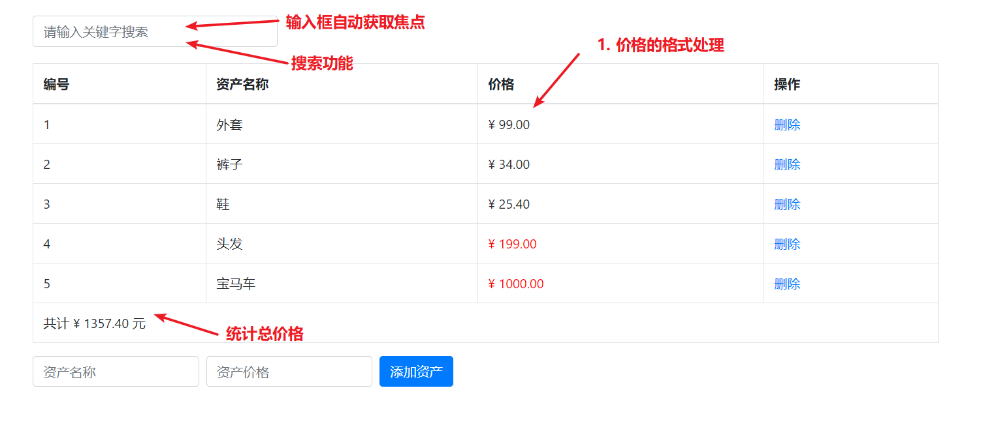

# vue 基础

## 课程介绍

- vue基础 - 7 天

- vue 后台管理项目 - 10 天
- webpack - 1 天
- vue 移动黑马头条 - 10天


## vue 的基本概念

vue官网地址:  https://cn.vuejs.org/

什么是 vue ?  vue是一个渐进式的 javascript 框架   

1. 渐进式  =>  逐渐增强, 可以学一点用一点, 利于上手!!!

2. 框架:  一套完整的解决方案

   特点: 需要按照框架的规则编写代码

   好处: 大大的提升了开发效率


## vue是一个MVVM的框架

MVVM是一种设计模式, 从后端的 MVC模式 演化而来

MVVM

1. M: Model 数据模型, 可以是自己准备的数据, 也可以是请求回来的数据
2. V: View 视图, 视图相关的
3. VM: ViewModel 视图模型, 既可以操作数据, 也可以操作视图


## vue初体验

1. 安装下载 vue

```txt
npm i vue
```

2. 引入一个 vue

3. 使用 vue - 初始化 vue 实例  **指定视图 和 数据**

```html
<div id="app">
  <h1>{{ msg }}</h1>
  <h1>{{ msg }}</h1>
</div>

<script src="./vue.js"></script>
<script>
  // 只要引入 vue.js, 那么全局就有了一个Vue 构造函数
  // 创建vue实例
  const vm = new Vue({
    // 指定视图 + 数据
    // 1. el element, 用于指定vue所管理的视图范围, 值是一个选择器
    el: '#app',
    // 2. data, 用于指定vue中可以使用的数据
    data: {
      msg: '你好, vue'
    }
  })
</script>
```


## vue使用的注意点

1. new Vue() 构造函数Vue, 首字母大写

2. el 不能指定为 html 和 body, 但是可以是一个大的div

3. 到了vue, 不要老想着操作dom了, 要更新视图, 操作数据即可     vm.xxx = 值


## vue 模板代码段的配置

左下角设置 => 用户代码段 =>  输入 html 回车


把原有的内容删除, 复制下面的内容进去

```json
{
  // 名字: 标识, 可以自己起
  "vue-template": {
    // 输入什么内容, 触发代码段   tpl + tab 触发代码段
    "prefix": "tpl",
    "body": [
      "<!DOCTYPE html>",
      "<html lang=\"en\">",
      "	<head>",
      "		<meta charset=\"UTF-8\" />",
      "		<meta name=\"viewport\" content=\"width=device-width, initial-scale=1.0\" />",
      "		<meta http-equiv=\"X-UA-Compatible\" content=\"ie=edge\" />",
      "		<title>Document</title>",
      "	</head>",
      "	<body>",
      "		<div id=\"app\">",
      "			{{ msg }}",
      "		</div>",
      "",
      "		<script src=\"./vue.js\"></script>",
      "		<script>",
      "			const vm = new Vue({",
      "				el: '#app',",
      "				data: {",
      "					msg: 'hello vue$1'",
      "				}",
      "			})",
      "		</script>",
      "	</body>",
      "</html>"
    ],
    "description": "vue 模板"
  }
}
```


# vue的插值表达式

插值表达式, 小胡子语法` {{  }}`

1. 作用:  使用 data 中的数据渲染视图

2. 基本语法, 支持三元运算符

   ```jsx
   {{ msg }}
   {{ obj.name }}
   {{ msg.toUpperCase() }}
   {{ obj.age > 18 ? '成年' : '未成年' }}
   ```

3. vue中插值表达式的注意点

   (1)  使用的数据在 data 中要存在

   ```jsx
   <h1>{{ gaga }}</h1>
   ```

   (2)  能使用表达式, 但是不能使用 if  for

   ```jsx
   <h1>{{ if (obj.age > 18 ) { }   }}</h1>
   ```

   (3)  不能在标签属性中使用

   ```jsx
   <h1 id="box" class="box" title="{{ msg }}"></h1>
   ```

   

# vue指令

**vue指令, 实质上就是特殊的 html 标签属性, 特点:  v- 开头**

每个 v- 开头的指令, 都有着自己独立的功能, 将来vue解析时, 会根据不同的指令提供不同的功能

## v-text 和 v-html

- v-text 设置元素的 innerText, 不识别标签, 基本可以被 插值表达式 替代, 不太常用
- v-html 设置元素的 innerHTML, 可以识别标签,  需要识别标签的时候, 使用v-html即可

```html
<div id="app">
  <h1>{{ msg }} 嘿嘿, 呵呵, 嘎嘎 {{ info }}</h1>
  <h1 v-text="msg"></h1>
  <h1 v-html="msg"></h1>
</div>

<script src="./vue.js"></script>
<script>
  const vm = new Vue({
    el: '#app',
    data: {
      msg: '<a href="#">我是a标签</a>',
      info: '你好'
    }
  })
</script>
```


## v-if 和 v-show

v-show 和 v-if 功能: 控制盒子的显示隐藏

1. v-show

   语法:  v-show="布尔值"    (true显示, false隐藏)

   原理:  实质是在控制元素的 css 样式,  `display: none;`

2. v-if

   语法: v-if="布尔值"   (true显示, false隐藏)

   原理:  实质是在动态的创建 或者 删除元素节点

应用场景: 

- 如果是频繁的切换显示隐藏, 用 v-show

  v-if, 频繁切换会大量的创建和删除元素, 消耗性能

- 如果是不用频繁切换, 要么显示, 要么隐藏的情况, 适合于用 v-if

  v-if 是惰性的, 如果初始值为 false, 那么这些元素就直接不创建了, 节省一些初始渲染开销

```html
<div id="app">
  <h1 v-show="flag">{{ msg }}</h1>
  <h1 v-if="flag">{{ msg }}</h1>
</div>

<script src="./vue.js"></script>
<script>
  const vm = new Vue({
    el: '#app',
    data: {
      msg: 'hello vue',
      flag: true
    }
  })
</script>
```


## v-else 和 v-else if

```html
<div id="app">
  <h1 v-if="isLogin">尊敬的超级vip, 你好</h1>
  <h1 v-else>你谁呀, 赶紧登陆~</h1>

  <hr>
  
  <h1 v-if="age >= 60">60岁以上, 广场舞</h1>
  <h1 v-else-if="age >= 30">30岁以上, 搓麻将</h1>
  <h1 v-else-if="age >= 20">20岁以上, 蹦迪</h1>
  <h1 v-else>20岁以下, 唱跳rap篮球</h1>
</div>

<script src="./vue.js"></script>
<script>
  const vm = new Vue({
    el: '#app',
    data: {
      msg: 'hello vue',
      isLogin: true,
      age: 18
    }
  })
</script>
```


## v-on指令

v-on功能: 用于注册事件 

1. 写内联语句, 将要执行的代码直接写在 "" 内部, 适合写少量代码

      v-on:事件名="要执行的代码"

2. 指向methods中的定义的函数

      v-on:事件名="methods中的函数"

3. 指向methods中的定义的函数，并传入参数

      v-on:事件名="methods中的函数(实参)"

 简写: @事件名

```html
<div id="app">
  <h3>v-on</h3>
  <div v-show="isShow">内容部分</div>
  
  <button v-on:click="isShow = !isShow">切换显示隐藏</button>
  <button v-on:click="fn1">切换显示隐藏</button>
  <button v-on:click="fn2(1, 2)">点击时调用函数并传值</button>
  
  <hr>
  
  <button @click="isShow = !isShow">切换显示隐藏</button>
  <button @click="fn1">切换显示隐藏</button>
  <button @click="fn2(1, 2)">点击时调用函数并传值</button>
  
</div>

<script src="./vue.js"></script>
<script>
  const vm = new Vue({
    el: '#app',
    data: {
      isShow: true
    },
    methods: {
      fn1 (e) {
        this.isShow = !this.isShow
      },
      fn2 (a, b) {
        console.log(a, b)
      }
    }
  })
</script>
```


## 案例-折叠面板

需求: 点击展开或收起时，把内容区域显示或者隐藏

```html
<!DOCTYPE html>
<html lang="en">
  <head>
    <meta charset="UTF-8" />
    <meta name="viewport" content="width=device-width, initial-scale=1.0" />
    <title>Document</title>
    <style>
      body {
        background-color: #ccc;
      }
      #app {
        width: 400px;
        margin: 20px auto;
        background-color: #fff;
        border: 4px solid blueviolet;
        border-radius: 1em;
        box-shadow: 3px 3px 3px rgba(0, 0, 0, 0.5);
        padding: 1em 2em 2em;
      }
      h3 {
        text-align: center;
      }
      .title {
        display: flex;
        justify-content: space-between;
        align-items: center;
        border: 1px solid #ccc;
        padding: 0 1em;
      }
      .title h4 {
        line-height: 2;
        margin: 0;
      }
      .container {
        border: 1px solid #ccc;
        padding: 0 1em;
      }
      .btn {
        /* 鼠标改成手的形状 */
        cursor: pointer;
      }
    </style>
  </head>
  <body>
    <div id="app">
      <h3>案例：折叠面板</h3>
      <div>
        <div class="title">
          <h4>芙蓉楼送辛渐</h4>
          <span class="btn" @click="isShow = !isShow">
            {{ isShow ? '收起' : '展开' }}
          </span>
        </div>
        <div class="container" v-show="isShow">
          <p>寒雨连江夜入吴，</p>
          <p>平明送客楚山孤。</p>
          <p>洛阳亲友如相问，</p>
          <p>一片冰心在玉壶。</p>
        </div>
      </div>
    </div>
    <script src="./vue.js"></script>
    <script>
      // 点击展开或收起时，把内容区域显示或者隐藏
      const vm = new Vue({
        el: '#app',
        data: {
          isShow: true
        }
      })
    </script>
  </body>
</html>
```


## v-on 按键修饰符

需求: 默认a标签点击会跳走,  希望阻止默认的跳转, 阻止默认行为  e.preventDefault()

- vue中获取事件对象

  (1) 没有传参, 通过形参接收 e

  (2) 传参了, 通过$event指代事件对象 e

- vue中提供的按键修饰符

  .prevent 阻止默认行为

  .stop 阻止冒泡

```html
<div id="app">
  <a @click="fn" href="http://www.baidu.com">去百度</a>
  <a @click="fn2(100, $event)" href="http://www.baidu.com">去百度2</a>
  <a @click.prevent="fn" href="http://www.baidu.com">去百度3</a>
</div>

<script src="./vue.js"></script>
<script>
  // 需求: 默认a标签点击会跳走,  希望阻止默认的跳转, 阻止默认行为  e.preventDefault()
  // - vue中获取事件对象
  // - vue中提供的按键修饰符
  //   .prevent 阻止默认行为
  //   .stop    阻止冒泡

  const vm = new Vue({
    el: '#app',
    data: {
      msg: 'hello vue'
    },
    methods: {
      fn (e) {
        e.preventDefault()
      },
      fn2 (num, e) {
        e.preventDefault()
      },
      fn3 () {
        console.log('嘿嘿')
      }
    }
  })
</script>
```


## v-bind指令

**作用: 访问data中的数据,  动态的设置html的标签属性**

语法: `v-bind:属性名="值"` ,  简写 `:属性名  = 值 `

```html
<div id="app">
  
  
</div>

<script src="./vue.js"></script>
<script>
  const vm = new Vue({
    el: '#app',
    data: {
      imgUrl: '02.jpg',
      msg: '这是一个美图',
      bb: '内容'
    }
  })
</script>
```


## v-for 

 v-for 作用: 遍历对象和数组

1. 遍历数组 (常用)

```
v-for="item in 数组名"  item每一项
v-for="(item, index) in 数组名"  item每一项 index下标
```

2. 遍历对象 (一般不用)

```
v-for="(value, prop) in 对象"  value属性值, prop属性名
```

```html
<div id="app">
  <ul>
    <li v-for="item in list">{{ item }}</li>
  </ul>

  <ul>
    <li v-for="(item, index) in list">{{ item }} 和 {{ index }}</li>
  </ul>

  <ul>
    <li v-for="(value, prop) in obj"> {{ value }} 和 {{ prop }}</li>
  </ul>
</div>

<script src="./vue.js"></script>
<script>
  const vm = new Vue({
    el: '#app',
    data: {
      list: ['貂蝉', '吕布', '小乔', '曹操'],
      obj: {
        name: '大桥',
        age: 79,
        desc: '坚固'
      }
    }
  })
</script>
```

3. 一般为了优化渲染的性能, 可以在遍历列表时, 加上一个 key属性, key一般指定成 id  (详细原理: 参见拓展视频)

```html
<div id="app">
  <!-- 一般为了优化渲染的性能, 可以在遍历列表时, 加上一个 key属性, key一般指定成 id -->
  <ul>
    <li v-for="item in list" :key="item.id">{{ item.name }} -- {{ item.price }}元/斤</li>
  </ul>
</div>

<script src="./vue.js"></script>
<script>
  const vm = new Vue({
    el: '#app',
    data: {
      list: [
        { id: 1, name: '苹果', price: '1.8', num: '10斤' },
        { id: 2, name: '鸭梨', price: '5.8', num: '20斤' },
        { id: 3, name: '榴莲', price: '9.8', num: '50斤' },
        { id: 4, name: '西瓜', price: '11.8', num: '60斤' }
      ]
    }
  })
</script>
```


## 案例: 购物车

功能1: 渲染数据

功能2: 删除数据

功能3: 删除光了, 购物车为空的提示消息

```html
  <body>
    <div id="app">
      <h3>我的购物车</h3>
      <div class="list">
        <div v-for="item in bookList" :key="item.id" class="book" :title="item.name">
          <a href="javascript:;">
            <div class="figure">
              
            </div>
            <h4 class="title" :title="item.name">
              {{ item.name }}
            </h4>
            <p class="desc"></p>
            <p class="price"><span class="num">{{ item.price }}</span></p>
          </a>
          <button @click="delBook(item.id)" class="btn" title="移出购物车">-</button>
        </div>
      </div>
      <div v-if="bookList.length == 0">购物车是空的！</div>
    </div>
    <script src="./vue.js"></script>
    <script>
      const vm = new Vue({
        el: '#app',
        data: {
          bookList: [
            {
              id: 1,
              name: '当你学会独处',
              price: 29.9,
              picSrc: 'http://img3m8.ddimg.cn/70/15/28522168-1_l_3.jpg'
            },
            ...
          ]
        },
        methods: {
          delBook (id) {
            this.bookList = this.bookList.filter(item => item.id !== id)
          }
        }
      })
    </script>
  </body>
```


## 补充: v-bind 对于 class 的增强

v-bind 对于类名操作的增强, 注意点, :class 不会影响到原来的 class 属性

:class="对象/数组"

```js
(1) :class="对象" 
	{ 类名: 布尔值, 类名: 布尔值 } 
	如果是true, 加上这个类, 如果是false, 移除这个类

(2) :class="数组"
	['类名1', '类名2', '类名3']
	只要有这个类, 就加上

(3) :class="对象/数组" 直接内联在结构中编写 (重点)
```

代码

```html
<!DOCTYPE html>
<html lang="en">
  <head>
    <meta charset="UTF-8" />
    <meta name="viewport" content="width=device-width, initial-scale=1.0" />
    <meta http-equiv="X-UA-Compatible" content="ie=edge" />
    <title>Document</title>
    <style>
      .base {
        width: 200px;
        height: 200px;
        background-color: pink;
      }
      .blue {
        background-color: blue;
      }
      .large {
        width: 400px;
        height: 400px;
      }
    </style>
  </head>
  <body>
    <!-- 
      v-bind 对于类名操作的增强, 注意点, :class 不会影响到原来的 class 属性
      :class="对象/数组"
      (1) :class="对象" 
          { 类名: 布尔值, 类名: 布尔值 } 
          如果是true, 加上这个类, 如果是false, 移出这个类

      (2) :class="数组"
          ['类名1', '类名2', '类名3']
          只要有这个类, 就加上

      (3) :class="对象/数组" 直接内联在结构中编写 (重点)

      最经典的写法: <div class="base" :class="{ blue: isBlue, large: isLarge }"></div>
     -->

    <div id="app">
      <div class="base" :class="obj">我是盒子</div>
      <hr>
      <div class="base" :class="arr">我是盒子</div>
      <hr>
      <div class="base" :class="{ blue: isBlue, large: isLarge }"></div>
    </div>

    <script src="./vue.js"></script>
    <script>
      const vm = new Vue({
        el: '#app',
        data: {
          msg: 'hello vue',
          obj: {
            blue: false,
            large: true
          },
          arr: ['pengpeng', 'large'],
          isBlue: false,
          isLarge: false
        }
      })
    </script>
  </body>
</html>
```


## 补充: v-bind 对于 style 的增强

```
:style="对象"  => :style="obj"
               =>  :style="{ width: '200px' }"
```

```html
<!DOCTYPE html>
<html lang="en">
  <head>
    <meta charset="UTF-8" />
    <meta name="viewport" content="width=device-width, initial-scale=1.0" />
    <meta http-equiv="X-UA-Compatible" content="ie=edge" />
    <title>Document</title>
  </head>
  <body>
    <div id="app">
      <div style="width: 200px; height: 100px; background-color: skyblue;" :style="obj">
        {{ msg }}
      </div>

      <div 
        style="width: 200px; height: 100px; background-color: skyblue;" 
        :style="{ width: '100px', height: '100px', backgroundColor: 'purple' }"
      >
        {{ msg }}
      </div>
    </div>
    <script src="./vue.js"></script>
    <script>
      const vm = new Vue({
        el: '#app',
        data: {
          msg: 'hello vue',
          obj: {
            width: '300px',
            height: '300px',
            backgroundColor: 'pink'
          }
        }
      })
    </script>
  </body>
</html>
```


## v-model

**作用: 给表单元素使用, 双向数据绑定 ** 

语法: v-model='值'

```html
<div id="app">
  <h1>{{ msg }}</h1>
  <input type="text" v-model="msg">
  <hr>
  用户名: <input type="text" v-model="username"> <br><br>
  密码: <input type="password" v-model="password"> <br><br>
  <button>登录</button>
</div>

<script src="./vue.js"></script>
<script>
  const vm = new Vue({
    el: '#app',
    data: {
      msg: 'hello vue',
      username: '',
      password: ''
    }
  })
</script>
```


## v-model 处理其他表单元素

**v-model 会忽略掉表单元素原本的value, checked等初始值**

textarea, select, checkbox

```html
<div id="app">
  <input type="text" v-model="msg">
  <hr>
  <textarea v-model="desc"></textarea>
  <p>{{ desc }}</p>
  <hr>
  <!-- select框的value值, 就是选中的option的value值 
       1. 可以用于获取
       2. 还可以用于设置
  -->
  <select v-model="cityId">
    <option value="1">上海</option>
    <option value="2">无锡</option>
    <option value="3">香港</option>
    <option value="4">北京</option>
    <option value="5">哈尔滨</option>
    <option value="6">齐齐哈尔</option>
  </select>
  <p>{{ cityId }}</p>
  <hr>
  <input type="checkbox" v-model="flag">
  <p>{{ flag }}</p>
</div>

<script src="./vue.js"></script>
<script>
  // 注意点: v-model设置了之后, 会忽略掉默认设置的value, checked等属性
  // 表单元素小练习
  // 1. textarea  value
  // 2. select/option  value
  // 3. checkbox复选框  checked属性

  const vm = new Vue({
    el: '#app',
    data: {
      msg: '123456',
      desc: '今天天气还行',
      cityId: 6,
      flag: false
    }
  })
</script>
```


## v-model 修饰符

- number

  如果想自动将用户的输入值, 用parseFloat转成数字类型, ，可以给 `v-model` 添加 `number` 修饰符：

  ```html
  <input v-model.number="age" type="number">
  ```

  如果这个值如果这个值无法转数字，则会返回原始的值。

- trim

  如果要自动过滤用户输入的首尾空白字符，可以给 `v-model` 添加 `trim` 修饰符：

  ```html
  <input v-model.trim="msg">
  ```

  

## 案例: 资产表格


目标：

- 1 完成表格列表渲染。
- 2 实现删除功能。
- 3 标注：如果价格超过100，标红色显示。
- 4 添加功能。

静态布局

```html
<!DOCTYPE html>
<html lang="en">
<head>
  <meta charset="UTF-8">
  <meta name="viewport" content="width=device-width, initial-scale=1.0">
  <title>Document</title>
  <link href="https://cdn.bootcdn.net/ajax/libs/twitter-bootstrap/4.4.1/css/bootstrap.min.css" rel="stylesheet">
</head>
<body>
  <div id="app">
    <div class="container">
      <table class="table table-bordered table-hover">
        <thead>
          <tr>
            <th>编号</th>
            <th>资产名称</th>
            <th>价格</th>
            <th>操作</th>
          </tr>
        </thead>
        <tbody>
          <tr>
            <td>1</td>
            <td>宝马</td>
            <td>20000</td>
            <td><a href="javascript:;">删除</a></td>
          </tr>
        </tbody>
      </table>
      
      <!-- 添加资产 -->
      <form class="form-inline">
        <div class="form-group">
          <div class="input-group">
            <input type="text" class="form-control" placeholder="资产名称" />
          </div>&nbsp;&nbsp;
          <div class="input-group">
            <input type="text" class="form-control" placeholder="资产价格" />
          </div>
        </div>&nbsp;&nbsp;
        <button class="btn btn-primary">添加资产</button>
      </form>
    </div>
  </div>
  <script>
      // 目标：
      // 1. 把表格数据显示出来
      // 2. 实现删除功能
      // 3. 标注：如果价格超过100，标红色显示。
      // 4. 添加功能
      
      // list: [
      //     { id: 1, name: '外套', price: 99 },
      //     { id: 2, name: '裤子', price: 34 },
      //     { id: 3, name: '鞋', price: 25.4 },
      //     { id: 4, name: '头发', price: 199 }
      // ]
  </script>
</body>
</html>
```

1 完成表格列表渲染

```html
<tbody>
  <tr v-for="(item, index) in list" :key="item.id">
    <td>{{ index + 1 }}</td>
    <td>{{ item.name }}</td>
    <td>{{ item.price }}</td>
    <td><a href="javascript:;">删除</a></td>
  </tr>
</tbody>
```

2 删除功能

```jsx
<td><a @click="del(item.id)" href="javascript:;">删除</a></td>

methods: {
  del (id) {
    this.list = this.list.filter(item => item.id !== id)
  }
}
```

3 标注：如果价格超过100，标红色显示。

```jsx
<style>
  .red {
    color: red;
  }
</style>

<td :class="{ red: item.price > 100 }">{{ item.price }}</td>
```

4 添加功能

- 1 注册添加的点击事件, 注意: 需要阻止默认行为

```jsx
<button @click.prevent="add" class="btn btn-primary">添加资产</button>
```

- 2 收集获取的输入信息  v-model 绑定

```jsx
<input v-model.trim="name" type="text" class="form-control" placeholder="资产名称" />

<input v-model.number="price" type="text" class="form-control" placeholder="资产价格" />
```

- 3 判断非空, 添加到 list 中

```js
add () {
  // console.log(this.name, this.price)
  // 简单非空判断
  if (this.name === '') return
  if (this.price === '' || this.price <= 0) return
  this.list.push({
    id: +new Date(),
    name: this.name,
    price: this.price
  })
  this.name = ''
  this.price = ''
}
```


# 未完成功能说明(目标)

**还有一些功能如果要实现, 需要学习新的语法~**



# 过滤器

## 过滤器的基本使用

过滤器的作用: 转换格式

过滤器本质上就是一个函数

```
格式x --- 过滤器 -----> 格式y
```

将来开发过程中, 肯定会有对于字符串进行处理转换的需求, vue中提供了一个专门的语法: 过滤器

1. 定义过滤器
   Vue.filter(过滤器名字, 处理字符串的函数)
   (1) 函数的返回值, 就是处理字符串的结果
   (2) 函数的形参, 可以拿到处理的字符串
2. 使用过滤器 `{{ msg | 过滤器名字 }}`

```html
<div id="app">
  <h1>{{ msg1 | upper }}</h1>
  <h1>{{ msg2 | upper }}</h1>
</div>

<script src="./vue.js"></script>
<script>
  Vue.filter('upper', function(value) {
    return value.toUpperCase()
  })

  const vm = new Vue({
    el: '#app',
    data: {
      msg1: 'hellovue',
      msg2: 'zhangsan'
    }
  })
</script>
```


## 利用过滤器处理日期

moment官网文档: http://momentjs.cn/docs/#/displaying/


```html
<div id="app">
  <h1>{{ date1 | time }}</h1>
  <h1>{{ date2 | time }}</h1>
</div>

<script src="./vue.js"></script>
<script src="./node_modules/moment/moment.js"></script>
<script>
  Vue.filter('time', function(value) {
    return moment(value).format('YYYY年MM月DD日 HH:mm:ss')
  })

  const vm = new Vue({
    el: '#app',
    data: {
      date1: 1601305782038,
      date2: 1201305782038
    }
  })
</script>
```


## 过滤器的参数

使用过滤器支持传参

```
{{ msg | 过滤器名字(参数1, 参数2) }}
```

代码

```html
<div id="app">
  <h1>{{ date1 | time("YYYY-MM-DD") }}</h1>
  <h2>{{ date2 | time }}</h2>
  <h2>{{ date2 | time }}</h2>
</div>

<script src="./vue.js"></script>
<script src="./node_modules/moment/moment.js"></script>
<script>
  Vue.filter('time', function(value, str='YYYY年MM月DD日 HH:mm:ss') {
    return moment(value).format(str)
  })

  const vm = new Vue({
    el: '#app',
    data: {
      date1: 1601305782038,
      date2: 1201305782038
    }
  })
</script>
```


## 全局过滤器 和 局部过滤器

全局过滤器: 在所有的vue实例中, 都可以使用 

局部过滤器: 只能在当前的vue实例中, 使用

```html
<div id="app">
  <h1>{{ msg | global | demo }}</h1>
</div>

<div id="app2">
  <h1>{{ msg | global | demo }}</h1>
</div>

<script src="./vue.js"></script>
<script>
  // 全局过滤器: 在所有的vue实例中, 都可以使用 
  // 局部过滤器: 只能在当前的vue实例中, 使用
  Vue.filter('global', function(value) {
    return value + '_global'
  })

  const vm = new Vue({
    el: '#app',
    data: {
      msg: 'hello vue'
    },
    filters: {
      // 过滤器名字: 处理函数
      demo: function(value) {
        return value + '_demo'
      }
    }
  })


  const vm2 = new Vue({
    el: '#app2',
    data: {
      msg: 'hello vue2'
    }
  })
</script>
```


## 资产表格 - 使用过滤器


```jsx
// 过滤器
Vue.filter('money', function(value) {
  return '¥ ' + value.toFixed(2)
})
```


# 自定义指令

目标: 一进入页面, 希望输入框能够获取焦点


## 自定义指令的基本使用

需求: 让输入框获取焦点

1. 定义指令 

   Vue.directive(指令名, 配置对象)

2. 使用指令

   使用时, v-指令名,  注意加上 v- 开头

```html
<div id="app">
  <input type="text">
  <input type="text">
  <input type="text" v-focus>
  <input type="text">
  <input type="text">
</div>

<script src="./vue.js"></script>
<script>
  // autofocus 有一定兼容, vue中不推荐直接使用
  // vue中推荐, 使用js的方式让元素获取焦点 inp.focus(), 将这个dom操作封装到自定义指令中
  
  // 自定义指令的语法:
  // 1. 定义指令
  // Vue.directive(指令名, 配置对象)
  // 2. 使用指令
  // 注意: v-指令 名
  Vue.directive('focus', {
    // inserted是一个函数, 会在指令所在元素被插入到页面中时执行
    inserted (el) {
      el.focus()
    }
  })
  
  const vm = new Vue({
    el: '#app',
    data: {
      msg: 'hello vue'
    }
  })
</script>
```


## 全局指令 和 局部指令

全局指令: 在任何vue实例中, 都可以访问到

局部指令: 只能在当前vue实例中可以访问

```jsx
// 全局定义
Vue.directive('focus', {
  // inserted是一个函数, 会在指令所在元素被插入到页面中时执行
  inserted (el) {
    el.focus()
  }
})

const vm = new Vue({
  el: '#app',
  data: {
    msg: 'hello vue'
  },
  directives: {
    // 局部定义
    red: {
      inserted (el) {
        el.style.color = 'red'
      }
    }
  }
})
```


## 案例: 资产表格 - 自定义指令

```js
// 自定义指令
Vue.directive('focus', {
  inserted (el) {
    el.focus()
  }
})
```


# 计算属性

需求: 要对 给定的字符串做翻转之后 再来显示

```html
<div id="app">
  <!-- 此处逻辑复杂 -->
  <h1>{{ msg.split('').reverse().join('') }}</h1>
</div>

<script src="./vue.js"></script>
<script>
  const vm = new Vue({
    el: '#app',
    data: {
      msg: 'javascript'
    }
  })
</script>
```

模板中写大量的表达式, 固然可以实现效果, 但是会使得模板过重, 难以维护

如果一个结果, 需要依赖data中的数据, 但是需要经过一些逻辑处理, 才能得到你想要的数据, 可以使用计算属性

## 计算属性基本使用

1. 写在 computed 中

2. 和 data 一样, 都是用于提供属性的

3. 计算属性: 写法是一个函数, 但实质是一个属性

   计算属性: 一个需要通过计算才能得到的属性, 计算的过程封装到了这个函数中, 函数的返回值就是属性值

```html
<div id="app">
  <!-- 此处逻辑复杂 -->
  <h1>{{ reverseMsg }}</h1>
</div>

<script src="./vue.js"></script>
<script>
  const vm = new Vue({
    el: '#app',
    data: {
      msg: 'javascript'
    },
    computed: {
      reverseMsg () {
        return this.msg.split('').reverse().join('')
      }
    }
  })
</script>
```

## 计算属性的优点

1. 将模板中的逻辑, 封装到了计算属性中, 便于维护

2. 计算属性, 有缓存的处理, 如果计算过了一个值, 就会将这个值缓存起来

   下次再获取这个值, 直接将缓存的结果返回 (跳过计算的过程)

3. 如果计算属性依赖的值, 变化了, 会自动重新计算, 并再次缓存

```html
<div id="app">
  <h1>{{ reverseMsgFn() }}</h1>
  <h1>{{ reverseMsgFn() }}</h1>
  <h1>{{ reverseMsgFn() }}</h1>
  <h1>{{ reverseMsgFn() }}</h1>
  <hr>
  <h1>计算属性, 有缓存的处理, 如果计算过了一个值, 就会将这个值缓存起来</h1>
  <h1>{{ reverseMsg }}</h1>
  <h1>{{ reverseMsg }}</h1>
  <h1>{{ reverseMsg }}</h1>
  <h1>{{ reverseMsg }}</h1>
</div>

<script src="./vue.js"></script>
<script>
  const vm = new Vue({
    el: '#app',
    data: {
      msg: 'javascript'
    },
    methods: {
      reverseMsgFn () {
        console.log('函数调用了')
        return this.msg.split('').reverse().join('')
      }
    },
    computed: {
      reverseMsg () {
        console.log('计算属性被执行了')
        return this.msg.split('').reverse().join('')
      }
    }
  })
</script>
```


## 资产表格: 计算属性 - 计算总价

需求: 计算总和


html底部结构

```html
<tfoot>
  <tr>
    <td colspan="4">共计 xxx 元</td>
  </tr>
</tfoot>
```

思路: 补充一个计算属性, 专门用于计算总和

```jsx
computed: {
  total () {
    // 对list中数据进行循环, 计算出总共的 price
    let totalPrice = 0
    this.list.forEach(item => {
      totalPrice += item.price
    })
    return totalPrice
  }
}

<tfoot>
  <td colspan="4">共计 {{ total | money }} 元</td>
</tfoot>
```


## 资产表格: 计算属性 - 搜索筛选

在筛选区域的 input 框中输入关键字, 则在下面的 list 中找出对应的项, 其他的项应该隐藏起来

- 收集用户的搜索关键字,  v-model

```jsx
data: {
	...
	key: ''
}

<input v-model="key" v-focus type="text" class="form-control search" placeholder="请输入关键字搜索">
```

- 定义一个计算属性, 根据关键字在list中进行数据的过滤, 找出符合条件的项展示

```jsx
showList () {
  // console.log(this.key)
  // 根据 this.key 对 list 进行过滤
  // 如果其中name包含 this.key 关键字, 则保留
  return this.list.filter(item => {
    if (item.name.includes(this.key)) {
      return true
    } else {
      return false
    }
  })
}

// 使用 showList
<tr v-for="(item, index) in showList" :key="item.id">
```

- 调整计算总价的计算规则

```js
total () {
  // 对list中数据进行循环, 计算出总共的 price
  let totalPrice = 0
  this.showList.forEach(item => {
    totalPrice += item.price
  })
  return totalPrice
},
```


# 自己写接口-mock(模拟)数据

在开发过程中, 很可能会遇到后端接口滞后的情况 

例如: 前端页面写完了, 后端的接口没有就绪, 我们就可以利用一些工具自己准备接口, 进行自测

## json-server的基本使用

json-server 是一个命令行工具, 可以起一套 增删改查的 遵循 restful 规范的 接口,  零编码

1. 全局安装

```
npm i json-server -g
```

2. 准备一个 json 文件,  data.json 文件

```jsx
{
	"list": [
    { "id": 1, "name": "外套", "price": 99 },
    { "id": 2, "name": "裤子", "price": 34 },
    { "id": 3, "name": "鞋", "price": 25.4 },
    { "id": 4, "name": "头发", "price": 199 }
  ]
}
```

3. 执行命令, 启动接口

```
json-server data.json
```

起的是一整套遵循 RESTful 规范 的接口,  特征:  通过请求方式来决定操作类别（添加，删除，修改，查询）

以上面启动的服务为例：

| 接口地址 | 请求方式 | 操作类型                    |
| -------- | -------- | --------------------------- |
| /list    | GET      | 获取全部数据                |
| /list/1  | GET      | 获取单个数据, 获取id为1的值 |
| /list    | POST     | 添加操作 {name,price}       |
| /list/1  | DELETE   | 删除操作                    |
| /list/1  | PUT      | 完整修改{name,price}        |
| /list/1  | PATCH    | 局部修改{name}              |

以上接口规则，就是restful规则。json-server提供的就是符合restful规则的接口。


## postman测试json-server

使用 postman 测试 json-server 提供的接口

### 获取全部数据

GET: http://localhost:3000/list


### 获取单个数据

以id为查询依据

GET: http://localhost:3000/list/1


### 根据条件查询数据 (搜索)

json-server服务器提供了条件查询的功能 

格式:  ?字段_like=值


注意: 不加引号！


### 添加操作

以json格式传递参数，id会自动增加。  content-type: 'application/json'

POST: http://localhost:3000/list/ 

`{"name": "电脑", "price": 6880}`


### 删除操作

根据id进行删除

DELETE: http://localhost:3000/list/1


### 完整修改

post 和 put patch  参数, 都要求在 body 中传递

以json格式传递参数

PUT: http://localhost:3000/list/3

要求必须传入一个完整的对象（如果这一条记录中有10个属性，则要传入10个属性），因为它会整体覆盖这条数据。


### 局部修改

以json格式传递参数

PATCH: http://localhost:3000/list/3

只需要传入要更改的字段（要修改哪个属性就传入哪个属性 ）。


## axios请求接口

axios 其实就是一个基于原生封装的, 一个用于发送ajax的插件包

axios提交数据的时候, 默认的数据类型 (content-type) 就是 application/json 格式, 和我们json-server接口是统一的

使用步骤:

1. 下载  npm i axios
2. 引包
3. 使用, 发送ajax

```js
axios({
  method: 请求方式,  // get/post/put/patch/delete
  url: 请求地址,
  data: 参数对象, // 这个参数对象会在请求体中进行提交  post/put/patch
  params: 参数对象, // 这个参数对象会在地址栏中拼接提交 get/delete   
}).then(成功的函数).catch(失败的函数)
```

例如:

```jsx
// 1. 获取全部数据
axios({
  method: 'get',
  url: 'http://localhost:3000/list'
}).then(res => {
  console.log(res.data)
}).catch(err => {
  console.log(err)
})

// 2. 按照条件查询数据
axios({
  method: 'get',
  url: 'http://localhost:3000/list',
  params: {
    name_like: '棒'
  }
}).then(res => {
  console.log(res.data)
}).catch(err => {
  console.log(err)
})

// 3. 添加数据
axios({
  method: 'post',
  url: 'http://localhost:3000/list',
  data: {
    name: '宝马车',
    price: 100
  }
}).then(res => {
  console.log(res.data)
}).catch(err => {
  console.log(err)
})
```


## axios的简写形式

对于比较简单接口调用，可以采用简写格式：

```jsx
// get类型的 params参数要放在写对象中
axios.get(url, { params: {} }).then(res=>{console.log('成功')})
                                                               
// post类型 直接写参数
axios.post(url, data).then(res=>{console.log('成功')})
```

代码

```jsx
// 1. 获取全部数据
axios.get('http://localhost:3000/list').then(res => {
  console.log(res.data)
})

// 2. 按照条件查询数据
axios.get('http://localhost:3000/list', { 
  params: { 
    name_like: '棒' 
  }
}).then(res => {
  console.log(res.data)
})

// 3. 添加数据
axios.post('http://localhost:3000/list', {
  name: '宝马车',
  price: 100
}).then(res => {
  console.log(res.data)
})

// 4. 删除数据
axios.delete('http://localhost:3000/list/2').then(res => {
  console.log('删除成功')
})

// 5. 局部修改
axios.patch('http://localhost:3000/list/4', {
  name: '嘎嘎鹏'
}).then(res => {
  console.log('修改成功')
})

// 6. 完整修改
axios.patch('http://localhost:3000/list/5', {
  name: '水果',
  price: 88
}).then(res => {
  console.log('修改成功')
})
```


# 案例: 接口版本的资产管理

**目标：**

- 用json-server启动后端接口服务器

- axios发请求

- 用vue管理视图

 ## axios请求数据

**目标：用axios请求json-server提供的接口，并显示数据出来。**

**静态页面**

```html
<!DOCTYPE html>
<html lang="en">
<head>
  <meta charset="UTF-8">
  <meta name="viewport" content="width=device-width, initial-scale=1.0">
  <title>Document</title>
  <link
    href="https://cdn.bootcdn.net/ajax/libs/twitter-bootstrap/4.4.1/css/bootstrap.min.css"
    rel="stylesheet"
  />
  <style>
    .search {
      width: 250px; 
      margin: 20px 0;
    }
  </style>
</head>

<body>
  <div id="app">
    <div class="container">
      <!-- 搜索 -->
      <input type="text" class="form-control search" placeholder="输入关键字进行搜索">
      <!-- 表格 -->
      <table class="table table-bordered table-hover">
        <thead>
          <tr>
            <th>编号</th>
            <th>资产名称</th>
            <th>资产价格</th>
            <th>操作</th>
          </tr>
        </thead>
        <tbody>
          <tr>
            <td>1</td>
            <td>xxx</td>
            <td>xxxx</td>
            <td><a href="javascript:;">删除</a></td>
          </tr>
        </tbody>
      </table>
      <!-- 添加资产 -->
			<form class="form-inline">
        <input type="text" class="form-control" placeholder="资产名称">
        &nbsp;&nbsp;
        <input type="text" class="form-control" placeholder="资产价格">
        &nbsp;&nbsp;
        <button class="btn btn-primary">添加资产</button>
      </form>
    </div>
  </div>
</body>

</html>
```

发送ajax请求获取数据, 在created发送

- vue可以配置一个 created 函数 (生命周期函数)  

  (其他生命周期函数, 用的不多, 项目后会统一介绍)

- 这个函数会在vue实例创建数据初始化完成后, 自动被调用

- 这个函数适合发送初始化渲染的 ajax 请求

```js
const vm = new Vue({
  el: '#app',
  data: {
    list: []
  },
  // 一进入页面发送ajax请求, 获取数据, 写在created函数中
  created () {
    // 发送获取请求
    axios.get('http://localhost:3000/list').then(res => {
      this.list = res.data
    })
  }
})
```


## 根据数据动态渲染

v-for 渲染即可

```jsx
<tbody>
  <tr v-for="(item, index) in list" :key="item.id">
    <td>{{ index + 1 }}</td>
    <td>{{ item.name }}</td>
    <td>{{ item.price }}</td>
    <td><a href="javascript:;">删除</a></td>
  </tr>
</tbody>
```


## 删除数据

1 注册点击事件, 传id

```jsx
<td><a @click="del(item.id)" href="#">删除</a></td>
```

2 根据id发送ajax请求

```jsx
del (id) {
  axios.delete(`http://localhost:3000/list/${id}`).then(res => {
    console.log('删除成功')
  })
}
```

3 需要重新渲染, 将获取数据的过程封装

```js
created () {
  this.getList()
},
methods: {
  getList () {
    // 发送获取请求
    axios.get('http://localhost:3000/list').then(res => {
      this.list = res.data
    })
  },
  del (id) {
    axios.delete(`http://localhost:3000/list/${id}`).then(res => {
      this.getList()
    })
  }
}
```


## 添加数据

1 注册点击事件, 注意阻止按钮的默认提交

```jsx
<button @click.prevent="add" class="btn btn-primary">添加资产</button>
```

2 添加时, 要获取到输入框的值, v-model进行绑定

```jsx
<input v-model.trim="name" type="text" class="form-control" placeholder="资产名称">

<input v-model.number="price" type="text" class="form-control" placeholder="资产价格">
```

3 进行 ajax 添加操作

```js
add () {
  if (this.name === '') return
  if (this.price === '' || this.price <= 0) return
  axios.post(`http://localhost:3000/list`, {
    name: this.name,
    price: this.price
  }).then(res => {
    this.getList()
    this.name = ''
    this.price = ''
  })
}
```


## 搜索功能 - 计算属性

1 双向绑定搜索框的值 v-model

```jsx
data: {
  key: ''
}

<input v-model="key" type="text" class="form-control search" placeholder="输入关键字进行搜索">
```

2 准备一个计算属性 showList, 根据 key 筛选出需要的数据, 展示

```jsx
computed: {
  showList () {
    return this.list.filter(item => {
      if (item.name.includes(this.key)) {
        return true
      } else {
        return false
      }
    })
  }
}
```

3 使用 showList 进行展示

```jsx
<tr v-for="(item, index) in showList" :key="item.id">
```


思考: 这里能实现, 是因为所有的数据, 我们一个请求都请求回来了, 所以可以基于拿到的数据进行搜索过滤!

**但是实际工作中, 数据量大了, 必然会做分页,  我们将来拿到的就只会是一页的数据, 纯本地就做不了搜索了** 

**那么搜索还是要发送ajax请求实现的!**


**需求: 希望用户在输入框中输, 实时的发送请求, 获取结果展示** => 实时监视输入框数据的变化, 需要用到侦听器

# watch 侦听器

## watch 监视基本语法

```html
<div id="app">
  <h1>{{ msg }}</h1>
  <button @click="fn">改值</button>
</div>

<script src="./vue.js"></script>
<script>
  // vue中提供了 watch 侦听器的语法, 可以监视数据的变化
  const vm = new Vue({
    el: '#app',
    data: {
      msg: 'hello vue',
      str: 'abc',
      obj: {
        name: '小花',
        age: 18
      }
    },
    methods: {
      fn () {
        this.msg = '嘎嘎'
      }
    },
    watch: {
      // 监视msg的变化
      msg (newValue, oldValue) {
        console.log('改变前:', oldValue, ', 改变后:', newValue, )
      },
      // 监视str的变化
      str (newValue, oldValue) {
        console.log('str变化了, 变成了:', newValue)
      },
      // 监视obj.age的变化
      'obj.age' (newValue, oldValue) {
        console.log('小花, 我一直看着你, 你变了, 你今年' + newValue + '岁')
      }
    }
  })
</script>
```

## 深度监视

如果要监视对象中所有属性的变化, 需要深度监视 deep

```jsx
watch: {
  // 如果要监视整个对象中所有属性的变化, 要使用深度监视 deep
  obj: {
    // 默认是false, 一旦配置了true, 表示对这个对象深度监视, 
    // 只要obj的任何一个属性变化了, 都会触发handler  (根据需求用, 不要滥用)
    deep: true,
    // 处理函数, obj变化了, 就会执行handler处理函数
    handler (newValue) {
      console.log(newValue)
    }
  }
}
```


## 资产管理 - 搜索 - ajax版本

```jsx
watch: {
  key (newValue) {
    axios.get('http://localhost:3000/list', {
      params: {
        name_like: newValue
      }
    }).then(res => {
      this.list = res.data
    })
  }
}
```


## 防抖处理 (拓展)

一改就发送 ajax 请求, 发送的 ajax 请求就太多了,  需要做防抖处理  

函数防抖（debounce）：当持续触发事件时，一定时间段内没有再触发事件，事件处理函数才会执行一次，如果设定的时间到来之前，又一次触发了事件，就重新开始延时。 

特征: 不会立刻执行, 先等等看, 在一定时间内没有再次触发, 才执行


如果用户, 一直在修改, 在输入, 就不发请求, 只有一段时间内用户不输入了, 没有再触发事件, 此时才会执行一次, 发送请求

```jsx
watch: {
  key (newValue) {
    clearTimeout(this.timeId)
    this.timeId = setTimeout(() => {
      axios.get('http://localhost:3000/list', {
        params: {
          name_like: newValue
        }
      }).then(res => {
        this.list = res.data
      })
    }, 300)
  }
}
```


# 组件化

## 组件化的概念

没有模块化 ?  之前所有的代码都写在同一个文件中

模块化:  对于 js 功能的拆分

组件化: 是一个对于 结构样式行为的 整体拆分


## 组件的基本使用 - vue组件全局定义

- 基本使用

  (1) 定义:  Vue.component(组件名, 配置)

  (2) 使用:  当成 html 标签

- 注意点:

  (1) 不能使用已有标签

  (2) 组件模板只能有一个根元素

```html
<div id="app">
  <pp-button></pp-button>
  <pp-button></pp-button>
  <pp-button></pp-button>
</div>

<script src="./vue.js"></script>
<script>
  Vue.component('pp-button', {
    // 模板, 指定组件的结构的
    template: `
      <div>
        <button>我是按钮</button>
        <div>我是组件</div>
      </div>
    `
  })

  // 根实例独有的属性 => el
  const vm = new Vue({
    el: '#app',
    data: {
      msg: 'hello vue'
    }
  })
</script>
```

有了组件, 就可以将一个页面, 进行拆分了

```html
<div class="container">
  <jd-header></jd-header>

  <jd-main></jd-main>

  <jd-footer></jd-footer>
</div>
```


## vscode 配置

左下角齿轮点开 => 设置  =>  右上角  =>   打开设置在中间粘进去

```jsx
  "emmet.triggerExpansionOnTab": true,
  // emmet 语法, 能够在js中使用, tab 生成结构
  "emmet.includeLanguages": {
    "javascript": "javascriptreact"
  },
```


## 全局组件 和 局部组件 (了解)

全局组件: 在所有的vue实例中, 都可以使用的组件

局部组件: 只能在当前的vue实例中使用的组件

```html
<div id="app">
  <hello></hello>
  <demo></demo>
</div>

<div id="app2">
  <hello></hello>
  <demo></demo>
</div>

<script src="./vue.js"></script>
<script>

  // 全局组件
  Vue.component('hello', {
    template: `
      <div>我是hello组件</div>
    `
  })

  const vm = new Vue({
    el: '#app',
    data: {
      msg: 'hello vue'
    },
    // filters
    components: {
      // 组件名: 组件配置对象
      demo: {
        template: `
          <div>我是demo组件</div>
        `
      }
    }
  })


  const vm2 = new Vue({
    el: '#app2',
    data: {
      msg: 'hello vue2'
    }
  })
</script>
```


## 组件的其他配置项

组件是可以复用的 vue 实例, 所以vue实例怎么配, 组件就怎么配置

配置区别:

1.  根vue实例, 有 el 参数,  组件需要配置 template
2.  组件中的 data 必须是一个函数, 函数内部需要返回一个对象 (保证数据的独立)

```html
<div id="app">
  <demo></demo>
  <demo></demo>
  <demo></demo>
</div>

<script src="./vue.js"></script>
<script>
  // 组件是可复用的vue实例, new Vue怎么配, 组件也可以怎么配
  // 例如: data methods computed watch ...
  Vue.component('demo', {
    template: `
      <div>
        <div>我是demo组件 - {{ count }}</div>
        <button @click="fn">按钮</button>  
      </div>
    `,
    // 一个组件的data选项必须是一个函数, 为了保证每个组件数据的独立性!
    // 每当组件被使用时, 就会执行 data 函数, 将data函数的返回的对象, 作为当前组件的数据对象
    data () {
      // 这种写法, 就是为了保证数据的独立性, 每次使用组件, 都会提供一个新的独立的数据对象
      return {
        count: 0
      }
    },
    methods: {
      fn () {
        this.count++
      }
    }
  })

  // 根实例 和 组件 配置区别:
  // 1. el 是根实例独有的
  // 2. data 对于根实例是一个对象, data对于组件是一个函数, 且在函数中要返回一个对象
  const vm = new Vue({
    el: '#app',
    data: {
      msg: 'hello vue'
    }
  })
</script>
```


## 安装使用 vue 调试工具 - chrome插件

1、解压今天资料中的 vue-devtools.zip 文件，注意：解压到某个不会改动的目录。


2、进入chrome浏览的扩展程序


3、打开开发者模式


4、加载已解压的扩展程序


5、 开启文件访问权限


开启允许文件地址访问, 不然直接右键, 浏览器打开的页面, 将无法使用这个工具进行调试


## 案例:多个折叠面板

目标: 之前我们做过折叠面板案例, 但是如果一个页面中要有多个折叠面板效果, 就需要用到组件封装

```html
<!DOCTYPE html>
<html lang="en">
  <head>
    <meta charset="UTF-8" />
    <meta name="viewport" content="width=device-width, initial-scale=1.0" />
    <title>Document</title>
    <style>
      body {
        background-color: #ccc;
      }
      #app {
        width: 400px;
        margin: 20px auto;
        background-color: #fff;
        border: 4px solid blueviolet;
        border-radius: 1em;
        box-shadow: 3px 3px 3px rgba(0, 0, 0, 0.5);
        padding: 1em 2em 2em;
      }
      .pannel {
        margin-bottom: 30px;
      }
      h3 {
        text-align: center;
      }
      .title {
        display: flex;
        justify-content: space-between;
        align-items: center;
        border: 1px solid #ccc;
        padding: 0 1em;
      }
      .title h4 {
        line-height: 2;
        margin: 0;
      }
      .container {
        border: 1px solid #ccc;
        padding: 0 1em;
      }
      .btn {
        /* 鼠标改成手的形状 */
        cursor: pointer;
      }
    </style>
  </head>
  <body>
    <div id="app">
      <h3>案例：折叠面板</h3>
      <div class="pannel">
        <div class="title">
          <h4>芙蓉楼送辛渐</h4>
          <!-- 按钮 -->
          <span class="btn" @click="isShow = !isShow">
            {{ isShow ? '收起' : '展开' }}
          </span>
        </div>

        <!-- 切换显示的部分 -->
        <div class="container" v-show="isShow">
          <p>寒雨连江夜入吴，</p>
          <p>平明送客楚山孤。</p>
          <p>洛阳亲友如相问，</p>
          <p>一片冰心在玉壶。</p>
        </div>
      </div>
    </div>
    <script src="./vue.js"></script>
    <script>
      // 需求: 点击展开或收起时，把内容区域显示或者隐藏
      const vm = new Vue({
        el: '#app',
        data: {
          isShow: true
        } 
      })
    </script>
  </body>
</html>
```

封装成组件

```jsx
<pannel></pannel>
<pannel></pannel>
```

```js
Vue.component('pannel', {
  template: `
    <div class="pannel">
      <div class="title">
        <h4>芙蓉楼送辛渐</h4>
        <!-- 按钮 -->
        <span class="btn" @click="isShow = !isShow">
          {{ isShow ? '收起' : '展开' }}
        </span>
      </div>

      <!-- 切换显示的部分 -->
      <div class="container" v-show="isShow">
        <p>寒雨连江夜入吴，</p>
        <p>平明送客楚山孤。</p>
        <p>洛阳亲友如相问，</p>
        <p>一片冰心在玉壶。</p>
      </div>
    </div>
  `,
  data () {
    return {
      isShow: true
    }
  }
})
```

**问题: 折叠面板的标题和内容都写死了,  需要学习新的知识点!**


## 组件通信 - 父传子

### 父传子基本语法

1. 给子组件以添加html标签属性的方式传值   规范: 添加的属性, 要求全小写
2. 在子组件中, 通过 props 可以进行接收传递的参数

```html
<style>
  #app {
    width: 400px;
    height: 400px;
    background-color: pink;
  }
  .son {
    width: 300px;
    height: 200px;
    background-color: skyblue;
  }

</style>

<div id="app">
  <h3>这是父组件</h3>
  <son :house="house" car="宝马车"></son>
</div>

<script src="./vue.js"></script>
<script>
  Vue.component('son', {
    template: `
      <div class="son">
        <h4>我是son组件</h4>
        <p>父传来的数据: {{ house }} - {{ car }}</p>
      </div>
    `,
    props: ['house', 'car']
  })

  const vm = new Vue({
    el: '#app',
    data: {
      house: '独栋大别墅'
    }
  })
</script>
```

### 不要修改props

组件的数据来源有两个, data 和 props

1. data是自己的数据, 随便改

2. props是父组件传递过来的, 是外部的数据, 不要修改 (要遵循一个开发规范: 单向数据流)

单向数据流, 父组件的数据传递给子组件, 只要父组件的数据变化了, 自动重新向下流动, 进而子组件会进行更新

如果子组件可以随意修改父组件的数据, 那么数据就会自动再从父组件向下流动, 进而就影响了其他子组件, 会使得应用难以维护

```html
<div id="app">
  <h3>这是父组件</h3>
  <son :house="house"></son>
</div>

<script src="./vue.js"></script>
<script>
  // 开发时要遵循一个开发规范: 单向数据流
  // 单向数据流, 父组件的数据传递给子组件, 只要父组件的数据变化了, 自动重新向下流动, 进而子组件会进行更新

  // 记住: 子组件不要随便去修改父组件的数据, 因为很可能会直接影响到其他子组件(不合理的)
  // 所以: 父组件的数据交给父组件自己去修改
  Vue.component('son', {
    template: `
      <div class="son">
        <h4>我是son组件</h4>
        <p>自己的数据: {{ msg }}</p>
        <p>父组件传来的数据: {{ house }}</p>
        <button @click="change">改值</button>
      </div>
    `,
    data () {
      return {
        msg: 'son的数据'
      }
    },
    methods: {
      change () {
        // 修改自己的数据, 随便改
        // this.msg = '嘿嘿'

        // 修改老爹的数据, 不行!!! 没有遵循单向数据流
        this.house = '茅庐'
      }
    },
    props: ['house']
  })

  const vm = new Vue({
    el: '#app',
    data: {
      house: '新疆海景独栋大别墅'
    }
  })
</script>
```


## 案例: 折叠面板父传子

1. 添加属性传值

```jsx
<pannel title="芙蓉楼送辛渐" content="我是内容"></pannel>
```

2. 组件内部props接收参数

```jsx
Vue.component('pannel', {
  template: `
    <div class="pannel">
      <div class="title">
        <h4>{{ title }}</h4>
        <span class="btn" @click="isShow = !isShow">
          {{ isShow ? '收起' : '展开' }}
        </span>
      </div>

      <!-- 切换显示的部分 -->
      <div class="container" v-show="isShow">
        {{ content }}
      </div>
    </div>
  `,
  data () {
    return {
      isShow: true
    }
  },
  props: ['title', 'content']
})
```

**问题: 折叠内容部分不灵活, 现在只能是字符串, 希望内容能够是自己定制的结构, 需要学习插槽!!!**


## 插槽

### 默认插槽 slot

- 需求: 要在页面中显示一个对话框, 封装成一个组件

  通过父传子, 固然可以完成一定层面的组件的定制, 但是自定义性较差, 

  如果希望能够自定义组件内部的一些结构 => 就需要用到插槽

- **插槽作用: 用于实现组件的内容分发, 通过 slot 标签, 可以接收到写在组件标签内的内容**

```html
<!DOCTYPE html>
<html lang="en">
  <head>
    <meta charset="UTF-8" />
    <meta name="viewport" content="width=device-width, initial-scale=1.0" />
    <meta http-equiv="X-UA-Compatible" content="ie=edge" />
    <title>Document</title>
    <style>
      .modal {
        width: 300px;
        padding: 10px;
        background-color: skyblue;
        border: 3px solid #000;
        border-radius: 30px;
        margin: 10px;
      }
    </style>
  </head>
  <body>
    <div id="app">
      <modal title="警告">
        <input type="text">
        <input type="text">
        <input type="text">
        <input type="text">
      </modal>

      <modal title="再次警告">
        <p>我是一个段落</p>
        <p>我是一个段落</p>
        <p>我是一个段落</p>
        <p>我是一个段落</p>
        <p>我是一个段落</p>
      </modal>
    </div>

    <script src="./vue.js"></script>
    <script>
      Vue.component('modal', {
        template: `
          <div class="modal">
            <div className="title">
              <h3>{{ title }}</h3>  
            </div>
            <div className="content">
              <slot></slot>
            </div>
            <div className="bottom">
              <button>确认</button>
              <button>取消</button>
            </div>
          </div>
        `,
        props: ['title']
      })

      const vm = new Vue({
        el: '#app',
        data: {
          msg: 'hello vue'
        }
      })
    </script>
  </body>
</html>
```


### 具名插槽

插槽的分类:

1. 默认插槽(匿名插槽)

   `<slot></slot>` 只要没有具体分发的内容, 都会给到默认插槽

   `<slot name="default"></slot>` 是默认插槽完整的写法 和 `<slot></slot>` 完全等价

2. 具名插槽: 具有名字的插槽 (配置了名字),  可以实现定向分发

   一旦配置了名字, 只会接收对应的内容, 不是分发给他的, 就不要

   步骤:

   (1) 给插槽起名字 

   ```jsx
   <slot name="content"></slot>
   ```

   (2) 需要使用 template 标签, 将内容包裹成一个整体

   (3) 通过 v-slot:插槽名, 指定具体分发给谁

   ```html
   <template v-slot:content>
   	<input type="text">
   	<input type="text">
   	<input type="text">
   	<input type="text">
   </template>
   ```


### 作用域插槽

作用域插槽: 定义 slot 插槽的同时, 是可以传值的, 将来在分发内容时, 可以使用

1. 给 slot 标签, 以 添加属性的方式传值

```jsx
<slot name="bottom" :yes="yes" :no="no" money="100"></slot>
```

2. 所有添加的属性, 都会被收集到一个对象中

```js
{ yes: '确认', no: '取消', money: '100' }
```

3. 在template中, 通过  `v-slot:插槽名= "obj"` 接收

```jsx
<template v-slot:bottom="obj">
  <!-- {{ obj }} -->
  <button>{{ obj.yes }}</button>
  <button>{{ obj.no }}</button>
  <button>{{ obj.money }}</button>
</template>
```


## 案例: 折叠面板插槽

1. 在组件标签内, 写自定义的结构内容

```jsx
<pannel title="芙蓉楼送辛渐">
  <p>12345</p>
  <p>上山打老虎</p>
</pannel>

<pannel title="悯农">
  <p><a href="#">锄禾日当午</a></p>
  <p><a href="#">汗滴禾下土</a></p>
</pannel>
```

2. 使用 slot 标签占位置, 接收定制的内容

```js
Vue.component('pannel', {
  template: `
    <div class="pannel">
      <div class="title">
        <h4>{{ title }}</h4>
        <span class="btn" @click="isShow = !isShow">
          {{ isShow ? '收起' : '展开' }}
        </span>
      </div>

      <!-- 切换显示的部分 -->
      <div class="container" v-show="isShow">
        <slot></slot>
      </div>
    </div>
  `,
  data() {
    return {
      isShow: true
    }
  },
  props: ['title', 'content']
})
```


## 子传父

1. 在子组件中, 通过触发事件的方式传值,   ( 注意: 事件名规范, 全小写 )

```js
this.$emit(事件名, 参数1, 参数2, ...)
```

2. 在父组件中, 给子组件注册对应的事件, 接收参数

```jsx
<son @事件名="fatherFn"></son>

methods: {
  fatherFn (参数1, 参数2, ...) {
		...
  }
}
```


## 综合案例: 测试题


静态结构

```html
<!DOCTYPE html>
<html lang="en">
  <head>
    <meta charset="UTF-8" />
    <meta name="viewport" content="width=device-width, initial-scale=1.0" />
    <meta http-equiv="X-UA-Compatible" content="ie=edge" />
    <title>Document</title>
    <style>
      .my-subject {
        border: 1px solid #000;
        width: 300px;
        margin: 10px;
        padding: 10px;
      }

    </style>
  </head>
  <body>
    <div id="app">
      <h4>测试题</h4>
      <div class="my-subject">
        <span>8</span> + <span>4</span> = <input type="text" class="sum">
        <button>提交</button>
      </div>
      
      <div class="my-subject">
        <span>2</span> + <span>7</span> = <input type="text" class="sum">
        <button>提交</button>
      </div>
      
      <div class="my-subject">
        <span>1</span> + <span>5</span> = <input type="text" class="sum">
        <button>提交</button>
      </div>
      
      <p>
        <span>1. 正确</span>
        <span>2. 错误</span>
        <span>3. 正确</span>
      </p>
    </div>

    <script src="./vue.js"></script>
    <script>
      const vm = new Vue({
        el: '#app',
        data: {
          msg: 'hello vue'
        }
      })
    </script>
  </body>
</html>
```

### 自定义题目个数

允许用户自定义题目的个数, (准备题目数组, v-for 遍历即可)

```js
list: [
  { id: 1, ans: '未完成' },
  { id: 2, ans: '未完成' },
  { id: 3, ans: '未完成' }
]
```

```html
<div id="app">
  <h4>测试题</h4>
  <my-subject v-for="item in list"></my-subject>
  <p>
    <span v-for="item in list">{{item.id}}. {{item.ans}} </span>
  </p>
</div>
```

### 题目随机数字

题目的数字写死了, 希望两个数字都能在组件内自己随机, 要求生成的数字 10 以内 (0-9的整数)

```js
Vue.component('my-subject', {
  template: `
    <div class="my-subject">
      <span>{{ num1 }}</span> + <span>{{ num2 }}</span> = <input type="text" class="sum">
      <button>提交</button>
    </div>
  `,
  data () {
    return {
      num1: Math.floor(Math.random() * 10),
      num2: Math.floor(Math.random() * 10)
    }
  }
})
```


### 提交计算结果

1. v-model收集输入框结果的值

```jsx
<input type="text" class="sum" v-model.trim.number="sum">

data () {
  return {
    ...
    sum: ''
  }
}
```

2. 给按钮添加点击事件, 点击时提交

```jsx
<button @click="submitAns">提交</button>
```

提交结果给父组件, 父组件去更新答题状态, 需要结果也需要题目 id 

```js
submitAns () {
  // 判断是否做对了
  const result = +(this.num1 + this.num2) === this.sum ? '正确' : '错误'
  this.$emit('submit-ans', {
    id: 题目id,
    ans: result
  })
}
```

所以需要将题目 id 父传子传递过来


3. 提交答案 和 id

```jsx
submitAns () {
  // 判断是否做对了
  const result = +(this.num1 + this.num2) === this.sum ? '正确' : '错误'
  this.$emit('submit-ans', {
    id: this.subjectid,
    ans: result
  })
}
```

4. 父组件注册事件接收


根据传递过来的 id 和 答案, 更新结果

```jsx
methods: {
  submitAns (obj) {
    const item = this.list.find(item => item.id === obj.id)
    item.ans = obj.ans
  }
}
```


## 测试题(小作业)

**需求: 答案只能提交一次**

答案应该只能提交一次, 如果提交完成了,  应该将按钮和输入框禁用

```html
<!DOCTYPE html>
<html lang="en">
  <head>
    <meta charset="UTF-8" />
    <meta name="viewport" content="width=device-width, initial-scale=1.0" />
    <meta http-equiv="X-UA-Compatible" content="ie=edge" />
    <title>Document</title>
    <style>
      .my-subject {
        border: 1px solid #000;
        width: 300px;
        margin: 10px;
        padding: 10px;
      }

    </style>
  </head>
  <body>
    <div id="app">
      <h4>测试题</h4>
      <my-subject 
        @submit-ans="submitAns" 
        v-for="item in list" 
        :key="item.id"
        :subjectid="item.id">
      </my-subject>
      <p>
        <span v-for="item in list">{{item.id}}. {{item.ans}} </span>
      </p>
    </div>

    <script src="./vue.js"></script>
    <script>
      Vue.component('my-subject', {
        template: `
          <div class="my-subject">
            <span>{{ num1 }}</span> + 
            <span>{{ num2 }}</span> = 
            <input type="text" class="sum" v-model.trim.number="sum" :disabled="isSubmit">
            <button @click="submitAns" :disabled="isSubmit">提交</button>
          </div>
        `,
        data () {
          return {
            num1: Math.floor(Math.random() * 10),
            num2: Math.floor(Math.random() * 10),
            sum: '',
            isSubmit: false
          }
        },
        props: ['subjectid'],
        methods: {
          submitAns () {
            // 判断是否做对了
            const result = +(this.num1 + this.num2) === this.sum ? '正确' : '错误'
            this.$emit('submit-ans', {
              id: this.subjectid,
              ans: result
            })
            this.isSubmit = true
          }
        }
      })

      const vm = new Vue({
        el: '#app',
        data: {
          list: [
            { id: 1, ans: '未完成' },
            { id: 2, ans: '未完成' },
            { id: 3, ans: '未完成' }
          ]
        },
        methods: {
          submitAns (obj) {
            const item = this.list.find(item => item.id === obj.id)
            item.ans = obj.ans
          }
        }
      })
    </script>
  </body>
</html>
```


# 路由

## 单页应用程序

**单页Web应用（single page web application，SPA）** **只有一张Web页面的应用,  所有的功能在一个页面上实现**

优势:

- 传统的多页面应用程序，每次请求服务器返回的都是一个完整的页面
- 单页面应用程序只有第一次会加载完整的页面,  以后每次请求仅仅获取必要的数据 
-  减少了请求体积，加快页面响应速度，降低了对服务器的压力,  SPA更好的用户体验，运行更加流畅

缺点:

- 首屏加载会相对较慢 (后面可以配置异步组件, 进行按需加载)
- **不利于 SEO** 搜索引擎优化 


## 路由介绍

路由, 其实就是一套映射的规则    (vue中, hash值 和 页面展示组件的 对应规则)

-  简单来说,路由就是一套映射规则(一对一的对应规则), 由开发人员制定规则 
- 当 URL 中的哈希值( `#` hash) 发生改变后,路由会根据制定好的**规则**, 展示对应的视图内容(组件)

路由的模拟实现 (了解)

```html
<div>
  <div>
    <a href="#/">主页</a>
    <a href="#/add">添加</a>
    <a href="#/list">列表</a>
  </div>

  <div id="content">
    <!-- // 模拟不同的地址栏中的hash值，显示不同的内容 -->
  </div>
</div>
<script>
  // 实现前端路由效果: 地址栏变化，页面内容变化
  // 1. 如何监听地址栏中hash值的变化？添加hashchange监听
  // 2. 如何获取当前地址栏中的hash值？location.hash
  window.addEventListener('hashchange', function (e) {
    console.log('hash值变了')
    // 根据不同的hash值，显示不同的内容到content区域
    switch (location.hash) {
      case '#/':
        document.getElementById('content').innerHTML = '这里主页的内容'
        break
      case '#/add':
        document.getElementById('content').innerHTML = '这里是add的内容'
        break
      case '#/list':
        document.getElementById('content').innerHTML = '这里是list的内容'
        break
      default:
        break
    }
  })
</script>
```


## vue-router  基本使用

vue-router是一个前端路由插件, 可以帮助我们监听地址栏hash的变化, 并切换展示的组件

1. 下载 vue-router

```
npm i vue-router
```

2. 引入, 只要引入vue-router,  全局就有一个 VueRouter 构造函数

```html
<script src="vue.js"></script>
<script src="vue-router.js"></script>
```

3. 创建路由对象

4. 关联vue实例和路由对象

```js
const router = new VueRouter()
const vm = new Vue({
  el: '#app',
  data: {
    msg: 'hello vue'
  },
  router
})
```


## 路由实现单页面应用

需求: 首页 - 列表页 - 登录页的切换

1. 配置路由规则 

   路由规则: 一个hash对应一个组件

   router是整个路由对象, 一个项目就一个路由对象

   route: 一个路由规则  { path: ...,  component: ... }

2. 配置路由的出口, 确定匹配到的组件显示的位置

   `<router-view></router-view>`

```html
<div id="app">
  <h3>单页应用程序</h3>
  <router-view></router-view>
</div>

<script src="./vue.js"></script>
<script src="./vue-router.js"></script>
<script>
  const router = new VueRouter({
    routes: [
      { path: '/home', component: { template: `<div>我是首页</div>` } },
      { path: '/list', component: { template: `<div>我是列表页</div>` } },
      { path: '/login', component: { template: `<div>我是登录页</div>` } }
    ]
  })

  const vm = new Vue({
    el: '#app',
    data: {
      msg: 'hello vue'
    },
    router
  })
</script>
```


## 路由导航链接的使用

vue-router中提供了一个标签 router-link

1. router-link 标签最终会被解析成 a 标签
2. to 可以指定跳转的地址

```
<router-link to="/home">链接</router-link>
```

如果希望一进入来, 就能到首页 , 重定向 =>  `redirect: '/home'`


## 让当前导航高亮 (精确匹配 和 模糊匹配)

需求: 点击切换后, 让当前导航高亮

如果匹配成功会有两个特殊的类 `router-link-exact-active router-link-active`

```css
.router-link-active 模糊匹配     可以匹配很多个不同的地址

.router-link-exact-active  精确匹配
```


## 动态路由匹配

我们经常需要把某种模式匹配到的所有路由，全都映射到同个组件。

例如，我们有一个 `User` 组件，对于所有 ID 各不相同的用户，都要使用这个组件来渲染。可以使用动态路由

其实, 就是在利用路由传参,  (这种形式的传参, 参数是路由的一部分)

```
#/user/1    ===>  显示id为1的用户
#/user/2    ===>  显示id为2的用户
#/user/3    ===>  显示id为3的用户
```

```javascript
const router = new VueRouter({
  routes: [
     { path: '/user/:id', component: User }
   ]
})
```

匹配  /user/1,  通过 this.$route, 可以获取到动态路由参数

this.$route.params.id


##  页面的跳转和传参

页面跳转的两种方式

```
1. 声明式导航:  router-link 中的 to 跳转
2. 编程式导航:  this.$router.push()   api跳转
```

传参的两种方式

```
1. 路径传参, 动态路由 (参数是路由的一部分)    /detail/100   /detail/101
2. 查询传参 (参数不是路由的一部分)           /detail?id=100   /detail?id=101
```

获取传参数的方式: （根据传参不同，获取参数也不同）

```
-  路径传参：this.$route.params.id
-  查询传参： this.$route.query.id
```

### 声明式导航

```html
<div id="app">
  <h3>页面的跳转及传参</h3>
  <router-link to="/">主页</router-link><br>
  <router-link to="/list">列表页(声明式,不传参)</router-link><br>
  <router-link to="/user/2">用户页(声明式,路径传参)</router-link><br>
  <router-link to="/product?id=10">商品页(声明式,查询传参)</router-link><br>
  <hr>
  <router-view></router-view>
</div>

<script src="./vue.js"></script>
<script src="./vue-router.js"></script>
<script>
  // 页面的跳转有两种方式
  // 1. 声明式导航
  // 2. 编程式导航
  const router = new VueRouter({
    routes: [
      { path: '/', component: { template: `<div>主页</div>` } },
      { path: '/list', component: { template: `<div>列表页</div>` } },
      { path: '/user/:id', component: { template: `<div>用户{{ $route.params.id }}</div>` } },
      { path: '/product', component: { template: `<div>商品{{ $route.query.id }}</div>` } },
    ]
  })

  const vm = new Vue({
    el: '#app',
    data: {
      msg: 'hello vue'
    },
    router
  })
</script>
```

### 编程式导航

```jsx
<button @click="goList">列表页(编程式,不传参)</button><br>
<button @click="goUser">用户页(编程式,路径传参)</button><br>
<button @click="goProduct">商品页(编程式,查询传参)</button><br>
  
goList() {
  // 跳转到 /list 路由页面
  this.$router.push('/list')
},
goUser() {
  // 跳转到 /user, 路径传参
  this.$router.push('/user/33')
},
goProduct() {
  // 跳转到 /product, 查询传参
  this.$router.push('/product?id=4')
}
```

**路由 push 方法, 在重复跳转到同一个路由会报错, 这个错误可以忽略, 或者粘入下面代码解决(不用记)**

```jsx
const originalPush = VueRouter.prototype.push
VueRouter.prototype.push = function push(location) {
  return originalPush.call(this, location).catch(err => err)
}
```


## 嵌套路由

### 案例 - 乐淘商城

基于已经学习的路由语法, 完成乐淘商城的单页切换

```jsx
<div class="lt_main">
  <router-view></router-view>
</div>

const Home = {
  template: `
    <div>我是首页</div>
  `
}
const Category = {
  template: `
    <div>我是分类页</div>
  `
}
const Cart = {
  template: `
    <div>我是购物车</div>
  `
}
const User = {
  template: `
    <div>我是用户中心</div>
  `
}

const router = new VueRouter({
  routes: [
    { path: '/home', component: Home },
    { path: '/category', component: Category },
    { path: '/cart', component: Cart },
    { path: '/user', component: User },
  ],
  linkActiveClass: 'current'
})

const vm = new Vue({
  el: '.lt_container',
  data: {},
  router
})
```

### 嵌套路由

底部的是一级导航,  将来一级导航下,  还可能会出现二级导航, 就需要配置嵌套路由

比如: 分类下, 还可能有一级分类, 二级分类,  通过 children 配置

```jsx
const Category = {
  template: `
    <div>
      我是分类页 - 
      <router-link to="/category">默认</router-link>
      <router-link to="/category/first">一级分类</router-link>
      <router-link to="/category/second">二级分类</router-link>
      <hr/>
      <router-view></router-view>
    </div>
  `
}
const First = {
  template: `
    <div>一级分类</div>
  `
}
const Second = {
  template: `
    <div>二级分类</div>
  `
}
const Default = {
  template: `
    <div>默认展示的内容</div>
  `
}

...

const router = new VueRouter({
  routes: [
    { path: '/home', component: Home },
    { 
      path: '/category', 
      component: Category,
      children: [
        { path: '', component: Default },
        { path: 'first', component: First },
        { path: 'second', component: Second }
      ] 
    },
    { path: '/cart', component: Cart },
    { path: '/user', component: User },
  ],
  linkActiveClass: 'current'
})
```


# yarn 的基本使用

```
mac:    sudo npm i yarn -g
windows:  推荐通过软件包安装    /  npm i yarn -g
```

快速、可靠、安全的依赖管理工具。和 npm 类似, 都是包管理工具, 可以用于下载包

下载地址: https://yarn.bootcss.com/docs/install/#windows-stable 

```text
1. 初始化
	yarn init  /  yarn init -y

2. 添加依赖
	yarn add [package]
	yarn add [package]@[version]

3. 移除包
	yarn remove [package]
             
4. 安装项目全部依赖            
	yarn 或者 yarn install

5. 全局
	安装: yarn global add [package]
	卸载: yarn global remove [package]
```

```
yarn global add json-server
```


# 颜色主题 和 图片主题

## 颜色主题


## 图标主题

安装插件


完成主题的配置


# 脚手架 - vue-cli

## vue-cli 介绍

> vue-cli是官方提供的开发vue项目的脚手架工具。

 **脚手架**是为了保证各施工过程顺利进行而搭设的工作平台。 

实际脚手架只是辅助开发的, 将来上线时(会打包), 就不需要脚手架的架子了

打包: 将多个文件, 合并压缩成一个文件, 方便请求, 节约服务器压力


vue-cli 可以快速提供一整套的 **vue项目开发**的 架子, 并且成为了一套开发vue的标准

提供了一系列工具

- 例如:  babel  语法降级的   https://www.babeljs.cn/   (es6  => es5/es3的浏览器能够识别的兼容代码)

- 例如:  eslint   约束语法风格的 (代码风格)  https://eslint.bootcss.com/

  ```
  for(let i = 0; i < 10; i++) {
  
  }
  ```

- 例如:  less 的语法转换, 将less转换成css, 供浏览器识别

- 例如:  提供了一个开发服务器, 保存自动刷新浏览器

- ....

总结:

- vue-cli 是一个开发项目过程，提供便利的一个平台, 可以更方便的开发项目, 提高开发效率


## vue-cli 安装

全局安装

```
yarn global add @vue/cli
或
npm i @vue/cli -g
```

如果 npm 安装慢，使用淘宝镜像。

```
npm i @vue/cli -g --registry=https://registry.npm.taobao.org
```

查看版本号

```
vue --version
```

如果能够输出版本号，就说明已经成功安装了脚手架工具了。  (例如: `@vue/cli 4.5.7` )


## vue-cli 创建项目

目标:

1. 用 vue-cli工具来创建vue项目。
2. 熟悉 vue项目 结构目录。

### 创建项目

步骤:

1. 打开命令行窗口, 执行命令

   ```
   vue create 项目名称
   ```

2. 选择创建方式, 选择最后的自定义创建

   ```cmd
   Vue CLI v4.5.7
   ? Please pick a preset: (Use arrow keys)
     Default ([Vue 2] babel, eslint)
     Default (Vue 3 Preview) ([Vue 3] babel, eslint)  
   > Manually select features
   ```

3. 选择需要的模块

   


4. 选择vue版本, 2.x

   

5. 是否采用路由 history 历史模式 (不采用, 这个模式, 需要后台配合)

   

6. css预处理器, 选择 less

   


7. eslint规范, 选择标准化的无分号规范

   

8. 选择是否进行eslint规范校验, 开启保存时校验, (这里直接回车即可)

   

9. 相关的一些配置文件存放在哪, 配置到package.json中即可, 这样目录更简洁

   


10. 是否保存刚才预设的步骤, 输入 n,   (不存了, 我们下次建项目, 还是再一个个选一下加强练习)

    

11. 回车后, 会开始下载, 等待一会, 最后下载成功界面如下

    

12. 启动项目 (**先进入目录**, 再在项目根目录运行 yarn serve)

    ```txt
    cd 04-vue-demo
    
    yarn serve
    ```


**大工告成!!** 去浏览器访问  http://localhost:8080


### 熟悉目录结构

利用 vue create 项目名, 会直接生成一套项目的目录


在开发时，我们需要把自己的代码写在`src`目录下。


由于我们是初学, 所以整个 src 内的结构不认识是正常的, 所以我们将 src 目录清空, 从零开始理解


重新 yarn serve 启动项目


## es6 模块化

es6 提供了标准化的模块化规范

- **按需 **导入与导出   可以导出多个值, 可以按需导入

  - 导出：

  ```jsx
  export const num1 = 11
  export const num2 = 22
  export function fn1 () {
  	console.log('这是fn1')
  }
  ```

  - 导入：

  ```js
  import { num1, fn1 } from 'js模块路径'
  ```

  

- **默认** 导入 和 导出  只能导出一个值

  - 导出

  ```js
  export default 导出的内容
  ```

  - 导入

  ```js
  import 变量名 from 'js模块路径'
  ```

  

## elint 格式化配置

对于不熟悉eslint规则的我们, 这个报错, 太影响学习效率了, 所以一般会借助 vscode 插件, 辅助我们熟悉eslint的规范

我们可以配置保存时, 自动修复格式bug

步骤:

1. vscode 安装 eslint 插件

   

2. 将下面的配置代码粘贴到vscode配置文件中  (左下角齿轮 =>  设置 => 右上角点开  )

   ```json
   "editor.codeActionsOnSave": {
      "source.fixAll.eslint": true
   },
   ```

**配置成功效果图:**


**注意点:**

1. 需要将整个项目以根目录的方式, 单独在vscode中打开, 不然eslint插件, 就会不生效 (保存不会自动修复)

   

   错误演示

   

2. 关闭自动保存

   

3. 关闭保存自动格式化

   


## 单文件组件

**用一个.vue为后缀的文件来声明一个组件。**

1. 以前定义组件的方式

```jsx
// 全局注册组件
Vue.component('com-a',{
  // 组件配置对象
  template: '<div>组件结构</div>'
})

new Vue({
  // 局部注册组件
  components: {
    'com-b': {
      // 组件配置对象
      template: '<div>组件结构</div>'
    }
  }
})
```

无论是何种注册方式，每个组件必须有一个组件配置化对象。

且之前的配置对象写起来有很大的缺点: 1. 没有结构高亮  2. 忽略了css


2. 现在定义组件

以 .vue 文件的方式来定义组件，文件的内容代表的是：**组件配置对象**，称为：单文件组件。需要安装插件 vetur 才能高亮


共有三个部分

- template（可选 ）： 约定这个组件的视图
- script（必须）: 设置除了template之外的组件配置项
- style（可选 ）: 用来组件中元素的样式

```vue
<template>
  <div>
    我是jack组件
  </div>
</template>

<script>
export default {
  data () {
    return {
      msg: 'abc'
    }
  }
}
</script>

<style>

</style>
```


## main.js 内容详解

我们看到默认的main.js内容是这样的

```jsx
import Vue from 'vue'
import App from './App.vue'
import router from './router'

new Vue({
  router,
  render: h => h(App)
}).$mount('#app')
```


需求: 使用App.vue作为根组件, 渲染index.html

```jsx
import Vue from 'vue'
import App from './App.vue'

new Vue({
  render: h => h(App)
}).$mount('#app')

// 需求: 使用App.vue作为根组件, 渲染index.html
// const vm = new Vue({
//   el: '#app',
//   render: function (createElement) {
//     return createElement(App)
//   }
// })
// console.log(vm)
```


##  配置路由详解

需求: 配置一个 首页 列表页 登录页 切换的 单页

和之前不同的在于, 配置对象用的是单文件组件, 且需要 Vue.use 一下

```jsx
import Vue from 'vue'
import VueRouter from 'vue-router'
import App from './App.vue'
import Home from './views/Home.vue'
import List from './views/List.vue'
import Login from './views/Login.vue'

Vue.use(VueRouter)

const router = new VueRouter({
  routes: [
    { path: '/home', component: Home },
    { path: '/list', component: List },
    { path: '/login', component: Login }
  ]
})

new Vue({
  render: h => h(App),
  router
}).$mount('#app')
```


## 路由抽离到一个 js 文件中

`router/index.js`

```jsx
import Vue from 'vue'
import VueRouter from 'vue-router'
import Home from '../views/Home.vue'
import List from '../views/List.vue'
import Login from '../views/Login.vue'

Vue.use(VueRouter)

const router = new VueRouter({
  routes: [
    { path: '/home', component: Home },
    { path: '/list', component: List },
    { path: '/login', component: Login }
  ]
})

export default router
```

`main.js`

```jsx
import Vue from 'vue'
import App from './App.vue'
import router from './router'

new Vue({
  render: h => h(App),
  router
}).$mount('#app')
```


## 补充: package.json 中的命令行

实际上 yarn serve 执行的是 package.json 中配置的命令~


# 实战案例 hero


