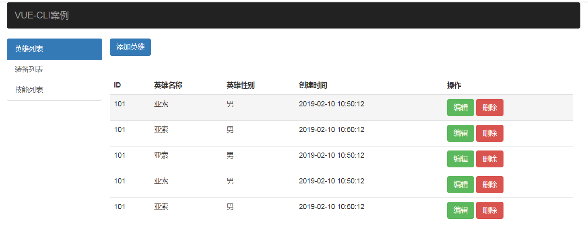
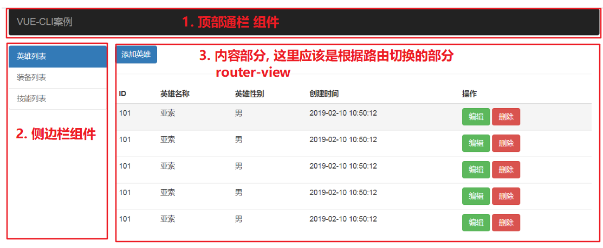
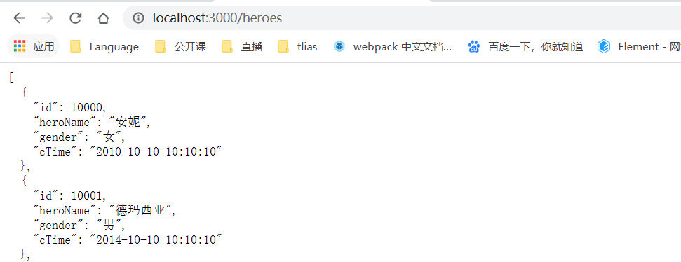
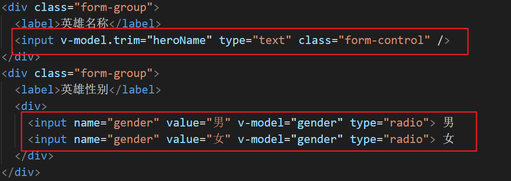
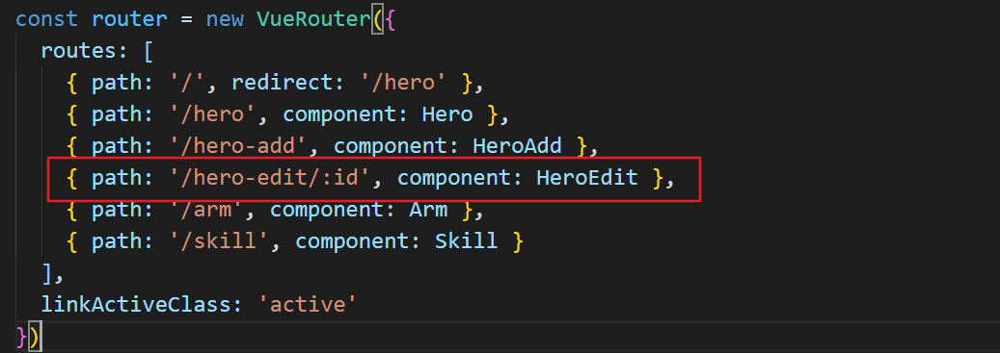
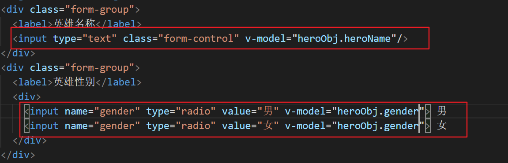

# hero 案例

## 案例介绍



功能介绍：

- 英雄列表
  - 列表展示
  - 删除功能
  - 添加功能
  - 编辑功能


## 脚手架创建项目

1. 创建项目

```
vue create hero-project
```

2. 删除 src 下目录文件, 只留 main.js,  新建 App.vue

```js
// 使用App组件, 作为根组件渲染 index.html
import Vue from 'vue'
import App from './App.vue'

new Vue({
  render: h => h(App)
}).$mount('#app')
```


## 引入 bootstrap, 改造App.vue

1. 安装 bootstrap

```txt
yarn add bootstrap@3.3.7
```

2. 在main.js中导入

```js
import 'bootstrap/dist/css/bootstrap.min.css'
```

3. 准备结构

   col-md-2   中屏及中屏以上, 占两份

   col-md-10 中屏及中屏以上, 占十份

   navbar:  https://v3.bootcss.com/components/#navbar-inverted

   list-group: https://v3.bootcss.com/components/#list-group

```jsx
<template>
  <div id="app" class="container">
    <div class="navbar navbar-inverse">
      <a href="#" class="navbar-brand">VUE-CLI案例</a>
    </div>

    <div class="col-md-2">
      <div class="row">
        <div class="list-group">
            <a href="#" class="list-group-item active">英雄列表</a>
            <a href="#" class="list-group-item">装备列表</a>
            <a href="#" class="list-group-item">技能列表</a>
        </div>
      </div>
    </div>

    <div class="col-md-10">
      内容部分
    </div>
  </div>
</template>
```


## 实现顶部通栏组件

分析布局:



1. 新建组件 `components/nav-bar.vue`

```html
<template>
  <div class="navbar navbar-inverse">
    <a href="#" class="navbar-brand">VUE-CLI案例</a>
  </div>
</template>

<script>
export default {
    
}
</script>

<style>

</style>

```

2. 在App.vue中引入该组件
   - 导入
   - 局部注册组件
   - 在模板中使用

```html
<template>
  <div id="app" class="container">
    <nav-bar></nav-bar>

    <div class="col-md-2">
      侧边栏
    </div>

    <div class="col-md-10">
      路由容器
    </div>
  </div>
</template>

<script>
import NavBar from './components/nav-bar.vue'

export default {
  components: {
    NavBar
  }
}
</script>

<style></style>
```


## 实现左侧侧边栏组件

1. 新建侧边栏组件 `components/my-aside.vue`

```html
<template>
  <div class="my-aside">
    <div class="row">
      <div class="list-group">
          <a href="#" class="list-group-item active">英雄列表</a>
          <a href="#" class="list-group-item">装备列表</a>
          <a href="#" class="list-group-item">技能列表</a>
      </div>
    </div>
  </div>
</template>

<script>
export default {

}
</script>

<style>

</style>
```

2. 导入注册成局部组件

```jsx
import MyAside from './components/my-aside.vue'

export default {
  components: {
    MyAside
  }
}
```


## 实现基本路由

目标: 在左侧导航点击时, 右侧显示不同的内容  => 配置路由, 完成英雄(Hero), 武器装备(Arm), 技能(Skill) 的切换

1. 新建三个页面 `views/Hero.vue`,   `views/Arm.vue`,   `views/Skill.vue`

   例如:

```html
<template>
  <div class="hero">
    英雄列表
  </div>
</template>

<script>
export default {

}
</script>

<style>

</style>
```

2. 新建 `router/index.js` 配置路由

```jsx
import Vue from 'vue'
import VueRouter from 'vue-router'
import Hero from '../views/Hero.vue'
import Arm from '../views/Arm.vue'
import Skill from '../views/Skill.vue'
Vue.use(VueRouter)

const router = new VueRouter({
  routes: [
    { path: '/', redirect: '/hero' },
    { path: '/hero', component: Hero },
    { path: '/arm', component: Arm },
    { path: '/skill', component: Skill }
  ]
})

export default router
```

3. 在 `main.js` 中导入,挂载 router

```js
// 使用App组件, 作为根组件渲染 index.html
import Vue from 'vue'
import App from './App.vue'
import router from './router'
// 导入bootstrap的样式
import 'bootstrap/dist/css/bootstrap.min.css'

new Vue({
  render: h => h(App),
  router
}).$mount('#app')
```

4. `App.vue`中准备路由出口

```html
<template>
  <div id="app" class="container">
    <nav-bar></nav-bar>

    <div class="col-md-2">
      <my-aside></my-aside>
    </div>

    <div class="col-md-10">
      <router-view></router-view>
    </div>
  </div>
</template>
```


## 左侧导航 router-link 改造

1. 将 a 标签改写成 router-link

```jsx
<template>
  <div class="my-aside">
    <div class="row">
      <div class="list-group">
          <router-link to="/hero" class="list-group-item active">英雄列表</router-link>
          <router-link to="/arm" class="list-group-item">装备列表</router-link>
          <router-link to="/skill" class="list-group-item">技能列表</router-link>
      </div>
    </div>
  </div>
</template>
```

2. 自定义高亮的类名

   https://router.vuejs.org/zh/api/#linkactiveclass

```jsx
const router = new VueRouter({
  routes: [
    { path: '/', redirect: '/hero' },
    { path: '/hero', component: Hero },
    { path: '/arm', component: Arm },
    { path: '/skill', component: Skill }
  ],
  linkActiveClass: 'active'
})
```


## 列表展示

### 基本布局

```html
<template>
  <div class="hero">
    <p><a href="javascript:;" class="btn btn-primary">添加英雄</a></p>
    <table class="table table-hover">
      <thead>
        <tr>
          <th>ID</th>
          <th>英雄名称</th>
          <th>英雄性别</th>
          <th>创建时间</th>
          <th>操作</th>
        </tr>
      </thead>
      <tbody>
        <tr>
          <td>101</td>
          <td>亚索</td>
          <td>男</td>
          <td>2019-02-10 10:50:12</td>
          <td>
            <button class="btn btn-success">编辑</button>
            &nbsp;
            <button class="btn btn-danger">删除</button>
          </td>
        </tr>
      </tbody>
    </table>
  </div>
</template>

<script>
export default {}
</script>

```


###  json-server模拟接口

json-server 之前已经全局安装过了, 不需要重复安装

1. 新建一个 data.json 文件, 内容如下

```json
{
  "heroes":[
    { "id":10000, "heroName": "安妮", "gender": "女", "cTime": "2010-10-10 10:10:10" },
    { "id":10001, "heroName": "德玛西亚", "gender": "男", "cTime": "2014-10-10 10:10:10" },
    { "id":10002, "heroName": "刘三姐", "gender": "女", "cTime": "Fri Apr 17 2020 16:24:42 GMT+0800 (中国标准时间)" },
    { "id":10003, "heroName": "超人", "gender": "男", "cTime": "2020/10/10 10:10:10" }
  ]
}
```

2. 启动接口服务器

```
json-server data.json
```

打开 http://localhost:3000/heroes 测试




### axios 请求数据

1. 安装 axios

```
yarn add axios
```

2. 导入 axios

```
import axios from 'axios'
```

3. created中发送请求

```html
<script>
import axios from 'axios'
export default {
  created () {
    axios.get('http://localhost:3000/heroes').then(res => {
      console.log(res.data)
    })
  }
}
</script>
```


### 根据数据完成渲染

1. data中准备 list 数组

```js
data () {
  return {
    list: []
  }
},
```

2. 将拿到的数据存到 list 中

```js
axios.get('http://localhost:3000/heroes').then(res => {
  this.list = res.data
})
```

3. 利用 v-for 遍历渲染

```jsx
<tbody>
  <tr v-for="item in list" :key="item.id">
    <td>{{ item.id }}</td>
    <td>{{ item.heroName }}</td>
    <td>{{ item.gender }}</td>
    <td>{{ item.cTime }}</td>
    <td>
      <button class="btn btn-success">编辑</button>
      &nbsp;
      <button class="btn btn-danger">删除</button>
    </td>
  </tr>
</tbody>
```


### 使用过滤器 - 处理日期

在hero.vue组件中，对于时间的显示格式不友好，可以采用第三方的包moment来处理。

1. 安装 moment.js

```
yarn add moment
```

2. 定义全局过滤器

```jsx
import moment from 'moment'

// 定义全局过滤器
Vue.filter('time', function (value) {
  // 由于直接传入日期格式并不一定是moment期望的格式，所以这里统一用Date()来处理一下, 可以去除控制台的警告
  return moment(+new Date(value)).format('YYYY年MM月DD日 HH:mm:ss')
})
```

3. 使用过滤器

```jsx
<td>{{ item.cTime | time }}</td>
```


## 删除功能

步骤:

1. 注册点击事件
2. 弹出确认框
3. 点击确认发送请求
4. 删除成功, 更新列表

代码:

1. 注册点击事件

```html
<button @click="del(item.id)" class="btn btn-danger">删除</button>
```

2. 弹出确认框

```js
const flag = confirm('你确认要删除么?')
```

3. 发送 delete 请求进行删除
4. 删除成功, 更新列表

```jsx
created () {
  this.getList()
},
methods: {
  getList () {
    axios.get('http://localhost:3000/heroes').then(res => {
      this.list = res.data
    })
  },
  // 发送请求, 根据 id 删除
  del (id) {
    const flag = confirm('你确认要删除么?')
    if (flag) {
      // 要删除
      axios.delete(`http://localhost:3000/heroes/${id}`).then(res => {
        this.getList()
      })
    }
  }
}
```


## 添加功能

由于这个添加功能比较复杂，不方便与列表页做在一起，这里单独来设置一个页面组件来实现添加功能。

实现大致步骤：

1. 英雄列表组件，点击添加按钮, 跳转到 `/hero-add` 路由地址。
2. 定义路由规则，创建添加组件
3. 完成添加组件, 实现添加功能

### 准备添加页 和 路由

准备 HeroAdd.vue,  配置路由

```js
import HeroAdd from '../views/HeroAdd.vue'

const router = new VueRouter({
  routes: [
    { path: '/', redirect: '/hero' },
    { path: '/hero', component: Hero },
    { path: '/hero-add', component: HeroAdd },
    { path: '/arm', component: Arm },
    { path: '/skill', component: Skill }
  ],
  linkActiveClass: 'active'
})
```

在 `Hero.vue` 中点击按钮跳转路由

```html
<p><a href="javascript:;" class="btn btn-primary" @click="$router.push('/hero-add')">添加英雄</a></p>
```


### 添加页结构 - 完成添加功能

结构

```html
<template>
  <div class="hero-add">
    <legend>添加英雄</legend>
    <div class="form-group">
      <label>英雄名称</label>
      <input type="text" class="form-control" />
    </div>
    <div class="form-group">
      <label>英雄性别</label>
      <div>
        <input type="radio"> 男
        <input type="radio"> 女
      </div>
    </div>
    <button class="btn btn-primary">提交</button>
  </div>
</template>

<script>
export default {

}
</script>
```

1. 准备data的数据, 和表单元素双向绑定

```js
data () {
  return {
    heroName: '',
    gender: '男'
  }
}
```



2. 给添加按钮, 注册点击事件

```jsx
<button @click="add" class="btn btn-primary">提交</button>
```

3. 发送添加ajax请求, 添加完成, 跳转到列表页

```jsx
add () {
  if (this.heroName === '') return
  // 发送添加的ajax请求
  axios.post('http://localhost:3000/heroes', {
    heroName: this.heroName,
    gender: this.gender,
    cTime: +new Date()
  }).then(res => {
    this.$router.push('/hero')
  })
}
```


## 编辑功能

### 准备编辑页 和 路由

准备 HeroEdit.vue,  配置路由

```html
<template>
  <div class="hero-add">
    <legend>编辑英雄</legend>
    <div class="form-group">
      <label>英雄名称</label>
      <input type="text" class="form-control"/>
    </div>
    <div class="form-group">
      <label>英雄性别</label>
      <div>
        <input type="radio" value="男"> 男
        <input type="radio" value="女"> 女
      </div>
    </div>
    <button class="btn btn-primary">提交</button>
  </div>
</template>

<script>
export default {
  data () {
    return {}
  },
  methods: {

  }
}
</script>
```

这里需要配置动态路由, 编辑需要传递 id



点击编辑按钮, 跳转编辑页

```jsx
<button @click="goEdit(item.id)" class="btn btn-success">编辑</button>

goEdit (id) {
  this.$router.push(`/hero-edit/${id}`)
}
```


### 回显初始值

一进入编辑页, 需要显示该英雄的详情数据 (需要发送一次请求,  获取详情信息)

```jsx
import axios from 'axios'
export default {
  created () {
    const id = this.$route.params.id
    axios.get(`http://localhost:3000/heroes/${id}`).then(res => {
      this.heroObj = res.data
    })
  },
  data () {
    return {
      heroObj: {
        id: '',
        heroName: '',
        gender: '男',
        cTime: ''
      }
    }
  },
  methods: {

  }
}
```

v-model 和 输入框的值双向绑定, 进行回显展示




### 编辑完成

用户在页面上修改, 点击保存, 将改动通过 axios 调用接口完成保存

1. 给编辑按钮注册点击事件

```html
<button @click="edit" class="btn btn-primary">编辑提交</button>
```

2. 发送修改的put的ajax请求

```js
methods: {
  edit () {
    if (this.heroObj.heroName === '') return
    // 发送修改的ajax请求
    const id = this.$route.params.id
    axios.put(`http://localhost:3000/heroes/${id}`, this.heroObj).then(res => {
      this.$router.push('/hero')
    })
  }
}
```


## 优化

### axios 挂载到vue原型

很多组件都使用了axios，都需要先导入，再使用。

其实可以将 axios 挂载到 vue 原型上, 将来所有vue组件实例, 都可以直接访问到了

```js
import axios from 'axios'
Vue.prototype.$axios = axios
```

将来使用

```js
this.$axios.get(...).then(...)
```


### axios基准地址

https://www.kancloud.cn/yunye/axios/234845  搜索: 全局的 axios 默认值, 可以配置基准地址

项目中有很多处地方需要调用后台接口, 而接口地址每次, 前面都是写成了 `http://localhost:3000` 写死了

将来一旦上线, 必然这个接口地址会发生变化, 可以配置基准地址

```js
axios.defaults.baseURL = 'http://localhost:3000'
```


